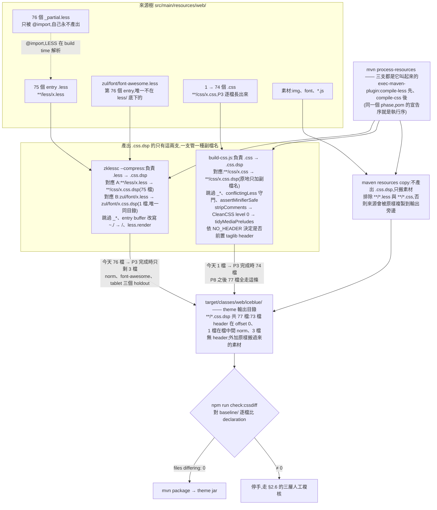

# IceBlue 棄用 LESS —— 實際執行計畫

**日期**:2026-07-29(背景章節補於 2026-07-31)
**分支**:`iceblue`(自 `master` 最新 commit 開出)
**工作目錄**:`../zkThemeTemplate-iceblue`(git worktree)
**決策依據**:下方〈背景〉章節
**外部佐證**:[css-preprocessor-industry-direction.md](css-preprocessor-industry-direction.md)

> ⚠️ **待修的懸空連結**:本文件多處引用「評估文」(`drop-less-pure-css-evaluation.md` §4.4 / §6 /
> §8.1,見 L19、L280、L712 等)。該檔**從未進版控**(`git log --all --diff-filter=A` 為空),
> 目前不在樹裡。下方〈背景〉章節接手它「交代原因」的職責;
> 那幾處指向特定小節的引用仍待補實或改寫。

---

## 背景:為什麼要放棄 LESS

### 決策窗口:ZK 11

IceBlue 要隨 **ZK 11(新 major version,開發中)** 出貨。這是唯一能落地不相容改變的窗口 ——
移除 LESS 變數這個**客戶正在使用、readme 主動教學**的客製 API(`readme.md:43,70-77,121`),
只能在 major 版做。錯過就是 ZK 12。

所以下面的評估不問「這個改變會不會破壞相容性」(會,而且是刻意的),
只問「**這個不相容值不值得**」。

### 贊成放棄的理由

依證據強度排序。標註**實測**的都在本計畫或姊妹文件裡有量測紀錄,不是推論。

| # | 理由 | 證據 | 強度 |
|---|---|---|---|
| **A1** | **LESS 在這個專案裡已經名存實亡** | 見下方展開 | 🔴 決定性 |
| **A2** | **兩套互相衝突的 theming API,readme 自己承認** | 見下方展開 | 🔴 決定性 |
| **A3** | preprocessor 會**靜默**改壞新 CSS 語法 | 見下方展開 | 🟠 強 |
| **A4** | Theme Pack 要 runtime 換主題,編譯期變數做不到 | L-7 拍板(§6);Ant Design v4→v6 同一條路 | 🟠 強 |
| **A5** | 業界方向 | [industry-direction.md](css-preprocessor-industry-direction.md) | 🟡 佐證 |
| **A6** | 降低客戶客製門檻 | `readme.md:6`「We assume you're already familiar with Less」+ 需 Node.js ≥10.16 → 改為「寫一個 `.css` 覆寫,零 build」 | 🟡 中 |
| **A7** | 與 Marble(ZK 11 預設主題)統一工具鏈 | Marble 已是純 CSS + custom properties + `@layer`;兩套工具鏈 = 兩份文件、兩種心智模型、兩套驗證。本計畫建的 `cssdiff` / 視覺 A/B harness 兩邊共用 | 🟡 中 |
| **A8** | `@layer` / `@scope` / container query 是我們要的,preprocessor 幫不上忙 | Marble 已證明 `@layer` 對「客戶覆寫」是真實架構收益。**注意:§0 已把 `@layer` 排除在本分支外** —— 這是動機,不是本分支的工作項 | 🟡 中 |

#### A1 展開 —— 我們付 preprocessor 的全額成本,只用到它的字串取代

| 量測 | 數字 | 出處 |
|---|---|---|
| LESS 變數宣告中,**純 1:1 pass-through 到 `var(--zk-token)`** | **834 / 846** | [`migration/less-var-to-token.md`](migration/less-var-to-token.md) |
| 30 個 mixin 名稱中**是死的**(零呼叫點、零輸出宣告) | **11** | 前提 #15;[`migration/mixin-to-css.md`](migration/mixin-to-css.md) |
| 活著的 mixin 裡,實質內容是「加瀏覽器前綴」的一行展開 | 大多數 | 前提 #16(245 呼叫點 → 1225 展開) |
| 顏色運算函式(`darken()`/`lighten()`/…) | **0** | — |
| `@media` 條件裡用到 LESS 變數 | **0** | — |
| **未壓縮輸出是否已經是可用的 `.css` 原始碼** | **是** | 前提 #5 —— 值全是 `var(--zk-*)`、mixin 已展開、縮排可讀 |

**結論:放棄 LESS 主要是「刪除」,不是「重寫」。** 這也是為什麼 P3(74 個元件檔)
可以「拿編譯輸出當新的原始碼」,而且正確性是構造上保證的(§1.1)。

#### A2 展開 —— 客戶面對兩條路,選錯就靜默失效

`readme.md:8-10` 原文:

> Please note that with the introduction of CSS Variables, you may not need to create a custom
> theme for simple customizations. If still adopting this approach of creating a theme jar, you
> need to be aware that **CSS variables will not take effect if you override the corresponding
> LESS variables.**

同時 master 自 **ZK 10.3 起已把 842 個 `--zk-*` 當作有文件的公開 API**。
所以現況是:**兩套 theming API 並存,而且互相靜默覆蓋**,readme 只能用一段警語去描述這個坑。

這不是設計取捨,是缺陷。ZK 11 是唯一能把它收斂成**單一 API** 的窗口。

#### A3 展開 —— 已實測的靜默改寫,而且無法靠 pin 版本根治

LESS 3.13.1 在 **exit 0** 的情況下改壞這四種(P1 實測):

| 輸入 | LESS 3.13.1 輸出 |
|---|---|
| `grid-column: 1 / -1` | `-1` |
| `aspect-ratio: 16 / 9` | `1.77777778` |
| `minmax(min(var(--x,180px),100%),1fr)` | `minmax(100%,1fr)` |
| `oklch(from red min(l,.54) c h)` | `oklch(from red .54 c h)` |

P1 已把版本釘到 **4.8.1**,四項全對。**但這只解決了實例,沒有解決類別** ——
LESS 會重新解析 CSS 值,所以每個新語法都是潛在的靜默改寫點;而 LESS 已進**維護模式**
(4.2 於 2025-11,無實質新功能)。ZK 11 想用的 `oklch()` 相對顏色、`color-mix()`、`@layer`
正好就是最容易踩雷的區域。

⚠️ **這條有直接的反面意見,見 B5** —— minifier 有同一類問題,所以這是「風險搬家」而非「風險消失」。

### 反對放棄的理由

不是為了平衡而列的。每一條都影響「賣點怎麼講」或「排程能不能保」。

| # | 反對意見 | 現況 | 是否被解決 |
|---|---|---|---|
| **B1** | **「純 CSS」不是字面真實 —— DSP 層還在** | 輸出仍是 `.css.dsp`,帶著 LESS 完全無關的 ZK DSP 層(輸出端實測,見下方展開)→ **不管有沒有 LESS,都還是要一個 build step** | ❌ **不會被解決**。只會從「外部 preprocessor + 第二語言」降成「一支 in-repo 腳本做字串組裝」 |
| **B2** | **迴圈沒有原生替代品** | `font-awesome.css.dsp` 是 **4545 條**(全樹最大),由 LESS `each()` 產生。原生 CSS 沒有迴圈,規格路線圖上也沒有 | ❌ **永久成立**。L-5 已拍板保留 FA → P6 必須寫產生器。我們不是移除產生器,是把它從 LESS 換成 JS |
| **B3** | **客戶的 fork-merge 路徑會斷一次** | `readme.md:20` 教客戶 fork + merge upstream。153 檔改副檔名 + 內容 → 每個 fork 全面衝突 | 🟡 **緩解,未消除**。P3 一檔一顆 commit(§2.5)把衝突侷限在客戶真正改過的檔案;兩張遷移表已產出並提交 |
| **B4** | **23 套付費佈景是產品排程,不是工程排程** | L-7 拍板了**方向**(palette → runtime `--zk-*` sheet),沒拍板**誰做、何時做、綁 ZK 11 哪個里程碑**。Theme Pack 是付費商品,有客戶合約 | ❌ **未解決。本案最可能被外力延遲的一點** |
| **B5** | **靜默腐蝕是「搬家」不是「消失」**(直接反駁 A3) | CleanCSS 5.3.3 摧毀 `@scope` 與裸 `@layer` 時**只發 warning**;把選擇器位置的 DSP tag 改寫成 `${}".z-page "` 時 **0 errors 0 warnings** | 🟡 **部分**。差別在:minifier 是我們自己呼叫、可換、可加守衛(`build-css.js:129` 的 `HOSTILE_CONSTRUCTS` 已在做);LESS 是整條語言前端,守不住 |
| **B6** | **與 ZK core 的 `.less` 同步會斷** | 66 個共用檔中 **52 個**目前與 ZK core 位元組相同,轉換後全部分歧 | 🟡 **多半可解,但仍是推論**。ZK core **今天並沒有編譯它們**(`zk-parent/pom.xml` 的 `compile-less` 在休眠的 `<pluginManagement>` 裡),且 Marble 將成 ZK 11 預設 → 複本很可能是死的。**建議在 ZK 11 定案前跟 core RD 確認一次** |
| **B7** | **沒有立即的功能痛點** | IceBlue 今天正常出貨。痛點是**前瞻性**的(modern CSS、Theme Pack runtime 切換),不是現在的。排程吃緊時「它能動」是延後的正當理由 | 🟡 **雙向成立**。反過來:正因為現在沒壞,才是動它的最佳時機 —— 等到有痛點時窗口已關 |
| **B8** | **工作量不是零** | P3 74 檔、P4 1225 處展開、P5 `norm.css` 設計工作、P6 FA 產生器、P7 profile/palette | ✅ **已量化**。「拿編譯輸出當新原始碼」把 P3 從數週手工降成腳本 + 複審;P4/P5/P7 是有判斷的 delta 階段,每階段都有事先估算的上限(§4) |

#### B1 展開 —— DSP 層有多大,以及它集中在哪

輸出端實測(`baseline/`,77 個 `.css.dsp`)。**注意用輸出端數字**,理由同前提 #1 的更正:
閘門比的是輸出,來源端的呼叫點數會誤導。

| DSP 構造 | 出現次數 | 分佈在幾個輸出檔 |
|---|---|---|
| `<%@ taglib %>` directive | **222**(= 74 檔 × 3) | 74 / 77(前提 #9:3 檔沒有) |
| `<c:if …>` 在**選擇器位置** | **107** | **只有 2 檔** —— `norm.css.dsp` 93 + `tablet.css.dsp` 14 |
| `${c:encodeThemeURL(…)}` | 25 | 11 檔 |
| `${c:encodeURL(…)}` | 19 | ↑ 同一批 |

**兩個推論:**

1. **B1 成立** —— 這 222 + 107 + 44 個構造沒有一個是 CSS,純 CSS 檔案表達不了它們,
   所以 build step 是**永久**需求。對外不能講「移除建置工具」。
2. **但 DSP 負擔是高度集中的,不是散在 77 檔裡。** taglib header 是機械式前置(P2 已實作);
   真正需要判斷的 `<c:if>` 只在 **2 個檔**(而且 `norm` 的那 93 條正是 P5 要處理的 `@scope` 議題)、
   EL 只在 **11 個檔**。其餘 **66 個輸出檔的 DSP 內容就只有那三行 header** ——
   對它們而言「純 CSS + 一行前置」是字面真實的。

所以 B1 的正確表述是:**「零 build step」兌現不了,但「絕大多數檔案是純 CSS」兌現得了。**

### 淨判斷

**兩條理由單獨就足以支撐這個決定,而且都不依賴任何外部趨勢:**

- **A1** —— 我們已經在付 preprocessor 的全額成本(第二語言、外部工具鏈、靜默改寫風險),
  卻只用到它的字串取代功能。834/846 個變數是純 rename。
- **A2** —— 兩套 theming API 互相靜默覆蓋,readme 只能用警語描述。這是缺陷,不是取捨。

**業界方向(A5)是佐證,不是驅動力。** 不該因為「別人都這樣」而做;
它的用途是確認我們選的終點(runtime CSS custom properties)是收斂中的方向而非孤例 ——
Ant Design 花了 v4→v6 三個大版本走到這裡,推動力和我們一模一樣
(見 [industry-direction.md §D](css-preprocessor-industry-direction.md))。

**最誠實的反對是 B1 + B2 合起來:我們不會得到「零 build step」。**
真實結果是「LESS + zkless-engine + 第二語言」→「一支 in-repo JS 腳本 + 純 CSS」。
差別是真的(少一種語言、少一個維護模式的外部依賴、少一層會重新解析 CSS 值的前端),
但**如果對外賣點講成「移除建置工具」,那個賣點會兌現不了** —— DSP 層(222 個 taglib
directive、107 處選擇器位置的 `<c:if>`、44 處 EL)與 Font Awesome 的 4545 條生成內容都還在。

**賣點應該是 A2:收斂成單一 theming API。** 次要賣點是 B1 展開的第 2 點 ——
**77 個輸出檔裡有 66 個的 DSP 內容就只有三行 header**,對客戶而言那些檔案是字面意義上的純 CSS。

**最可能延遲本案的是 B4**(Theme Pack 排程),它是產品面的,工程這邊控制不了 ——
建議儘早把它從「方向已定」推進到「有負責人與里程碑」。

**待確認的假設只有一個:B6**(ZK core 的 `.less` 複本是不是死的)。
其餘反對意見要嘛已被計畫的機制吸收,要嘛是必須接受的成本。

---

## 0. 範圍

**做**:把 IceBlue 的 153 個 `.less` 換成純 CSS,移除 `zkless-engine` 依賴,在過程中不改變
瀏覽器實際收到的 CSS(除了明確決策要改的部分)。

**不做**(這個分支刻意排除,以免混淆驗證訊號):

| 排除項 | 理由 |
|---|---|
| 動 `master` | 佔位符 / 模板身分要跟 RD 討論後再定(評估文 §8.1) |
| 導入 `@layer` | 會改變 cascade 行為 → 無法用「零差異」驗證。獨立議題,獨立分支。**理由只是 cascade 語意,不是工具限制** —— LESS 4.8.1 編 `@layer` 是位元組正確的(前提 #21) |
| Marble token 改名 / 對齊 | 是另一份文件的 Part B,獨立決策 |
| 移植 Marble 的 utility classes | 獨立決策 |
| `--zk-*` token 增減 | 本分支只搬,不改名不增減 |

**一句話**:這個分支只證明一件事 —— **「IceBlue 不需要 LESS 也能產生一模一樣的 CSS」**。
其他現代化留給後續分支,各自帶自己的驗證。

---

## 1. 已驗證的前提(實測,不是推論)

計畫的每個階段都建立在這些量測上。全部在 scratchpad 跑過:

> **P0 已重新量測(2026-07-29)。** 下表第 1、10 項的數字在 P0 被 `scripts/cssdiff.js` 推翻 ——
> 原數字是**來源端**(`.less` 裡的宣告)而非**輸出端**(`.css.dsp` 裡的宣告)。閘門比的是輸出端,
> 所以以輸出端為準。已就地更正,原值以刪除線保留。詳見
> [iceblue-drop-less-progress.md](iceblue-drop-less-progress.md) 的〈P0 修正的前提〉。

| # | 事實 | 數據 |
|---|---|---|
| 1 | master 的 LESS 樹能完整編譯 | 77 個 `.css.dsp`,**14323** 條 declaration 記錄(~~14807~~;另有 436 條 DSP 指令單獨比對) |
| 2 | **LESS 3.13.1 → 4.8.1 在 master 的 LESS 樹上輸出零差異** | 77 檔全部 declaration-level IDENTICAL。**只對 master 的 LESS 成立** —— 同一組比對跑在 Marble 的現代 CSS 上有 9 條差異(見 P1)。**位元組層補測(2026-07-31):77 檔中 76 檔逐 byte 相同**,唯一例外 `font-awesome.css.dsp` 差 7 個 byte —— 3.13.1 在字串內插時多加了 7 個**來源本來沒有的**前導零(`.1em`→`0.1em`),4.8.1 照來源原樣輸出。方向上 4.8.1 更忠於來源,且落在 §2.1 的 `canonical-number` 正規化內。拆解見 §2.6 第 2 層 |
| 3 | **`--compress` 開/關 輸出零差異** | 同上 → 可以產生「可讀版」輸出而不影響語意 |
| 4 | **`//` → `/* */` 前處理後編譯,輸出零差異** | 同上 → 註解保留技巧是安全的 |
| 5 | 未壓縮輸出**已經是可用的 `.css` 原始碼** | 值全是 `var(--zk-*)`、mixin 已展開、縮排可讀 |
| 6 | 元件之間**沒有耦合** | `_zkvariables.less` 只是名稱轉發;值只進 `norm.css.dsp` |
| 7 | 基礎層樞紐是 `_header.less` | 73 個入口檔 import 它;它再 import 變數 + palette + mixins |
| 8 | 842 個 `--zk-*` 值只從一條路徑產生 | `norm.less` → `_zkcssvariables.less` → `profiles/_@{themeProfile}` |
| 9 | 3 個輸出檔沒有 taglib header | `js/zkmax/sel/css/{listbox,tree}.css.dsp`、`js/zkmax/grid/css/grid.css.dsp` |
| 10 | 規模分佈(**輸出端**) | **2** 檔 ≤4 條;最大 4 檔:font-awesome **4545**、norm **1500**、tablet **681**、combo **586**(原記 ~~12 檔 ≤4~~、~~norm 1243、font-awesome 910、tablet 421、combo 407~~ 是來源端數字) |
| 11 | `goldenlayout.css.dsp` 有**兩份逐條相同的輸出** | `js/zkmax/goldenlayout/css/` 與 `js/zkmax/layout/css/`,各 413 條、diff 0 → P3 要一起轉,或先確認哪一份是死路徑 |
| 12 | `tbeditor.css.dsp` 也有兩份,但**不相同** | `js/zkmax/tbeditor/` 380 條 vs `js/zkmax/inp/` 375 條,67 條差異 → 是兩個不同來源,不能當複本處理 |
| 13 | **有第二個 `_zkvariables.less`** | `zkmax/less/_zkvariables.less`,4 行 2 條,而且**不是 token**(`@iphone`/`@android` 是 media query 字串)→ §P8 的例外分類要加一類,刪檔清單要加一檔。**更正(prereq 實測)**:這兩條**是死的** —— `tablet.less:2` 只是 `@import` 了這個檔,但全樹 153 個 `.less` 對這兩個名稱是 **0 次引用**。分類要加,但 P7 不需要為它們編列移植工作 |
| 14 | `_zkmixins.less` 是 **30 個名稱 / 38 個定義列** | ~~24 個名稱~~、~~32 個定義~~ 都是量錯的。`24/32` 與 `30/38` 各自內部一致,`24/38` 各取一個 —— 描述不了任何檔案。`24` 來自 `\w`-only 的名稱 pattern,會**無聲丟掉 6 個帶連字號但可呼叫**的 mixin(`.encodeURL-verGradient`、`.gradient-ver/-hor/-diagm/-diagp/-rad`)。38 個定義列則一直是對的:差額是 LESS 的同名多載(依參數個數或 `when` guard 分派) |
| 15 | **11 個 mixin 是死的**(30 個中),分佈在 38 個定義列裡的 13 列 | 整個 gradient / IE9 堆疊。輸出端獨立佐證:baseline 裡 0 個 `linear-gradient`、`radial-gradient`、`-webkit-gradient(`、SVG data URI、`progid:` |
| 16 | **§P4 的估算被獨立重現,分毫不差** | 呼叫點 `borderRadius` 103、`boxShadow` 46、`transform` 42、`applyCSS3` 30、四角 24 = **245**,展開 **1225** —— 用另一支獨立寫的 parser 數出同樣結果 → P4 的 ≤1127 上限更可信 |
| 17 | **taglib header 是「一行」不是「三行」** | `--compress` 輸出裡三個 directive **無分隔字元串接、後面沒有換行**,CSS 緊接著開始(`button.css.dsp` 前 200 bytes 有 **0** 個換行)。P2 的 `build-css.js` 要照這個形狀產生 |
| 18 | **`norm.css.dsp` 的 taglib 在檔案中間**(byte 43088 / 72140) | 它先是 ~43 KB 的 `:root{--zk-*}`,**然後**才三個 taglib,再 normalize.css + `<c:if>` reset —— directive 落在 `norm.less` 引入 `_reset.less` 的接縫上。JSP page directive 位置無關所以合法,只是少見。**前提 #9 仍然成立**(真正完全沒有 header 的還是那 3 檔;77 檔中有 73 檔以 header 開頭)。影響:P2 的 builder **不可以假設「header 一定在 offset 0」**,P5 串接 norm 時要保留它在接縫的位置,不能上提 |
| 19 | **裸 `lessc` 能編這棵樹的 100% 語法 —— 唯一的障礙是 `@import "~./"`** | 用 `./node_modules/.bin/lessc` 繞過 `zkless-engine` 實測:`_header.less` 的 `e()`(吐 `<%@ taglib %>`)✅、`_reset.less` 的 **58** 處選擇器位置 `<c:if …>${".z-page "}</c:if>` ✅、guarded mixin ✅、`each()` ✅。`grid.less` ❌ —— 但錯在**第 1 行**且是 `FileError` 不是 `ParseError`(`@import` 在 parse time 解析,所以 2–309 行從未被讀到);把 `~./`→`/` 用 `sed` 過一遍(不改檔),**輸出與 `baseline/js/zul/grid/css/grid.css.dsp` 位元組相同**。影響:**P8 的 `.less` 分支是一行 shim,不是重寫一個編譯器** —— 引擎在語法層面的全部貢獻就是 `src/index.js:31` 那個 replace |
| 20 | **`~./` 出現的**位置**決定它是不是問題,而它只在 entry 檔被改寫** | `@import "~./…"`(第 1 行)由 **LESS 在 build time** 解析 → 必須翻譯;`.encodeThemeURL(background-image, '~./zul/img/…')`(第 295 行)由 **ZK 在 runtime** 解析成 `${c:encodeThemeURL("~./…")}` → 對 LESS 只是字串,原樣通過。而引擎只對**entry 檔的 buffer** 做那個 replace(partial 由 LESS 自己的 file manager 讀,看不到),所以 partial 裡的 `~./` import 永遠解不開。實測:**74 個 entry 用 `~./` import,partial 0 個** —— 這條不變條件從 ZK commit `53589bc7a8`(2013-05-20)起就承重,**從未寫下來**,現由 `scripts/check-less-conventions.js` 守住(S1) |
| 21 | **現代 CSS 走 LESS 4.8.1 出來是位元組正確的** | 實測(真正的 `zklessc --compress` 管線):`@layer a{…}` / 巢狀 `@layer` / `@layer` 裡包 `@media` / `@container` / `@scope` / `oklch(from red calc(l * .5) c h)` / `:has()` / `clamp()` / `container-type` / `aspect-ratio: 16 / 9` **全部正確**。兩個推論:(a) §0 排除 `@layer` 的理由是**cascade 語意**,不是「LESS 做不到」—— 不要日後把它誤記成工具限制;(b) `@layer` 連 3.13.1 都過得去,所以 **S0 解鎖的是更廣的 modern-CSS 方向,不是 `@layer`**(3.13.1 真正擋掉的是 `oklch(from …)`,那是硬 `ParseError`)。**真正的風險源在 minifier 那一端,不在 LESS**,見 §4 |

### 1.1 最關鍵的一項:第 5 點

`zklessc` 不壓縮時的輸出長這樣(`js/zul/wgt/css/button.css.dsp` 實際節錄):

```css
.z-button {
  font-family: var(--zk-base-title-font-family);
  color: var(--zk-button-color);
  min-height: var(--zk-base-button-height);
  border: var(--zk-button-border-width) solid var(--zk-button-border-color);
  -webkit-border-radius: var(--zk-input-border-radius);
  -moz-border-radius: var(--zk-input-border-radius);
  -o-border-radius: var(--zk-input-border-radius);
  -ms-border-radius: var(--zk-input-border-radius);
  border-radius: var(--zk-input-border-radius);
  ...
}
```

**LESS 變數已經解析成 `var(--zk-*)`,mixin 已經展開,格式可讀。**
所以每個元件的轉換不是「手工重寫」,而是「**拿編譯輸出當新的原始碼**」——
而且轉換的正確性是**構造上保證**的(未動任何一個 byte 之前,它逐條 declaration 就等於基準)。

這把 P3(74 個元件檔)從「數週手工」變成「一支腳本 + 人工複審」。

### 1.2 註解保留的正確做法(踩過的坑)

第 4 點的技巧是:編譯前把 `.less` 的 `//` 行註解改寫成 `/* */`,LESS 就會把它們帶進輸出。

**但只能對「正在轉換的入口檔」做,不能對共用 partial 做。** 實測若對整棵樹套用,
`_zkvariables.less` 的 40 多條 section 註解會被灌進**每一個**元件輸出:

```css
/* Global Variables */
/* ------------------------------------- */
/* Typography */
...   ← checkbox.css.dsp 裡出現的其實是變數檔的註解
```

### 1.3 一個 `.css.dsp` 是怎麼被產出來的

這張圖是後面每一階的共同底圖:§2.1 比的是哪一層、§P2 的雙來源是哪兩條 lane、§P3 一次動一個檔
動的是哪一格、§P5 要串接的是哪一個節點、§P8 拿掉的是哪一條 lane。



**每個節點的程式碼位置**(圖不重複寫細節,細節在這裡):

| 節點 | 程式碼 / 設定 |
|---|---|
| `zklessc` | `node_modules/zkless-engine/src/index.js:17-38` 的 `compileFile` —— 跳過 `_*`、`~./`→`/`、`less/`→`css/`。前提 #19/#20:引擎在語法層的全部貢獻就是第 31 行那個 replace |
| `build-css.js` | `scripts/build-css.js`:`walk` 254、`conflictingLess` 280、`minify` 235、`HEADER` 110、`NO_HEADER` 116 |
| `mvn process-resources` / `maven resources copy` | `pom.xml:121-137`(`compile-less`)、`:142-157`(`compile-css`)、`:92-113`(resources,排除 `**/*.less` 與 `**/*.css`) |
| 閘門 | `package.json` 的 `check:cssdiff` → `scripts/cssdiff.js`(§2.1) |

**三件從圖上讀得出來、但值得寫成句子的事:**

1. **圖停在 theme jar,是因為後面那一段本分支完全不動。** `.css.dsp` 不是 CSS,是一個**模板**;
   把它變成瀏覽器可用 CSS 的是 ZK 的 runtime —— `ThemeProvider.beforeWidgetCSS` →
   `ServletFns.resolveThemeURL` 把 `~./zul/css/norm.css.dsp` 改寫成 `~./iceblue/…`,再由
   `DspExtendlet` / `Interpreter` 求值 `<%@ taglib %>`、`<c:if>`、`c:encodeThemeURL`。
   這一段一個 byte 都不改,所以它是 §2.3 的根據:兩邊 declaration 相同 ⇒ 同一個 interpreter
   吃進去 ⇒ 送出的 byte 相同,不需要靠截圖。也正是 §B1 的「純 CSS 不是字面真實」——
   那一段不會因為棄用 LESS 而消失。
   程式碼:`zul/theme/StandardThemeProvider.java:81-87`(前綴是逐 edition 白名單,zkmax / zkex
   各自有一份)→ `zweb/…/web/fn/ServletFns.java:95`;`zweb/…/resource/DspExtendlet.java:76-82`、
   `144-152`。
2. **有三條路徑寫進同一個輸出目錄,而它們互相看不見。** `compile-css` 與 `compile-less` 同一個
   phase、宣告在後所以跑在後,一個忘記刪的 `.less` 會讓兩套工具鏈輸出同名檔案、後跑的靜默覆蓋 ——
   這正是 P3 漏掉第 5 步的形狀。守門員是 `conflictingLess`,不是閘門(閘門只會報一個查不出原因的
   逐檔差異)。
3. **這張圖會被改兩次,而且都是刻意的。** P5:`norm.css` 從單檔變成多來源串接,且 taglib 必須
   留在接縫、不可上提(見 `build-css.js` 檔頭的 P5 NOTE)。P8:`zklessc` 整條 lane 消失,
   左半邊只剩 `.css`。

---

## 2. 驗證策略

### 2.1 主閘門:declaration-level diff

工具:`scripts/cssdiff.js`(已寫好並驗證,scratchpad 版本待 P0 提交進 repo)。
它把每個 `.css.dsp` 攤平成有序的 `context || property:value` 記錄清單再逐筆比對。

**設計要點**(踩過的坑,都已修正):

- **DSP 指令要先抽離。** `.css.dsp` 不是純 CSS,`<%@ taglib %>` 與 `<c:if>` 位於任何 brace 之外,
  naive brace parser 會把它們併進第一個 selector,造成 74 個檔案假性差異。
- **順序敏感。** CSS declaration 順序有意義,所以比對是有序的,不是集合比對。
- **只正規化「證明無語意差異」的項目**,而且清單是可複審的:空白、`0.90`→`0.9`、`0px`→`0`、
  `a > b`→`a>b`、引號風格。
- **selector 與 value 要分開正規化。** `+` 在 selector 是相鄰選擇器,在 value 是 `calc()` 的加號 ——
  同一條規則套兩邊會出錯。

### 2.2 兩種閘門,不要混用

| 閘門 | 用在 | 判準 |
|---|---|---|
| **G-zero** | P1、P2、P3、P6 | `files differing: 0`。任何差異都是 bug |
| **G-delta** | P4a、P4b、P5、P7 | 差異必須**逐條對應到已決策的變更**,且總數符合預估。**每個階段只允許一種形狀** —— 這是 P4 拆成 P4a/P4b 的理由(見 §P4) |

**這是方法論上的重點:先把所有能「零差異」驗證的事做完,再做會改變輸出的事。**
如果邊轉換邊移除 vendor prefix,一旦出現差異就分不清是「轉換寫錯」還是「政策生效」。

**但兩種閘門都有同一個前提:被測的程式碼路徑真的被走到了。** 沒有輸入時「差異 0」是免費的 ——
P2 就是這樣(見 §P2〈閘門是空轉的〉),P6 會再遇到一次。**閘門過了,先問它走過什麼。**

### 2.3 視覺回歸是輔助,不是主閘門

declaration diff 在瀏覽器實際收到的 CSS 這一層是**完整的等價證明**(DSP 求值不變)。
視覺回歸只在 P4/P5/P7 這些有意改變輸出的階段才是必要的補充。

推論要講清楚:**P0–P3 與 P6 不需要截圖。** 這幾階段是 G-zero,declaration 相同就等於 render 相同,
截圖只會增加 flake、不會增加資訊。硬加視覺檢查反而製造一種假的安心感。
真正需要視覺 A/B 的機制見 §2.4。

### 2.4 視覺 A/B harness(P4 的前置)

**在哪些階段有價值,差別很大 —— 不要一視同仁:**

| 階段 | 價值 | 理由 |
|---|---|---|
| P5 | **最高** | `browserDefault` 從 descendant selector 改成 `@scope`,是真的會改變「誰被選到」的結構性變更 |
| P7 | 中 | profile 從編譯期 import 插值改成 runtime override sheet,機制換了 |
| P4 | **最低** | 「`-webkit-border-radius` 是不是死前綴」是**瀏覽器支援政策**問題,Chrome 截圖答不出來。這裡真正的證據是 §P4 的 declaration delta,不是像素 |

**做法:重用 Marble 已有的 harness,不搬頁面。** Marble repo 已經有:

- 158 個 preview `.zul` 頁面
- `src/test/java/zk/example/iceblue/ThemePreviewIceblueApp.java`(:8081)
- `scripts/capture-iceblue.js`、`scripts/render-iceblue-baseline.sh`
- pom execution `preview-app-iceblue`、Playwright 專案與既有 baseline

要補的只有一件事:**讓 preview app 能載入本模板編出來的 theme jar**。
現況 `ThemePreviewIceblueApp.java:27` 是刻意**不設** preferred theme —— 它渲染的是 ZK 內建的
iceblue,不是本模板的輸出。所以 A/B 的兩邊應該是**同一分支的兩次 build**:

```
P0 的 LESS build  →  theme jar A   ┐
                                    ├─→ 同一組 preview 頁面 → 截圖 diff
轉換後的 CSS build →  theme jar B  ┘
```

**兩個必須寫下來的限制:**

1. **157/158 個頁面用到 Marble 的 `z-*` utility classes,IceBlue 沒有這些 class**(§0 已排除移植)。
   對「自己比自己」的 A/B 這是可接受的 —— 兩邊一樣沒有 utility,而被轉換的 CSS 是**元件內部**的,
   照樣渲染。但**訊號品質會下降**:塌掉的版面可能遮住 P4/P5 改到的 border / shadow / spacing。
   看到乾淨的 diff 時要記得這一點,別把「沒看到差異」當成「沒有差異」。
2. **先證明儀器,再相信儀器。** 跟 P0 對 `cssdiff` 做的一樣:先拿**同一個 build** 截兩次、
   確認 diff 為零,才能開始拿它比對兩個不同 build。

**不做**:把 158 個 `.zul` + 221 個素材(9.2 MB)+ composer/VM Java 搬進本 worktree。
那會產生第二份會各自漂移的 preview 語料,而且本分支沒有 Playwright / npm test 相依。
「讓模板本身附帶更豐富的 preview 語料」(模板現在只有 `preview.zul`,`readme.md:84` 是叫使用者
自己加)是**產品改善,不是轉換需求** —— 與 §0 其他排除項同一個理由。

### 2.5 commit 粒度:為了 fork-merge,不是為了 AI 考古

`readme.md:20` 寫得很明白,本模板的使用方式是 **fork**,而且理由正是
「easier to merge bug fixes from the original repository and **migrate to the new version**」。
所以 merge 衝突的品質**直接取決於 commit 粒度** —— 這是本節的主要理由,比「留給 AI 看歷史」強得多。

一個客戶 fork 之後客製了 `button.less`。若整個 P3 是一顆 commit,他 merge 上游時會對一個
74 檔的巨大變更產生衝突;若是一檔一顆,git 能自動解掉他沒動過的絕大多數,衝突被侷限在那一檔。

**粒度跟著「變更的性質」走,不是跟著階段走:**

| 階段 | 粒度 | 理由 |
|---|---|---|
| P3 | **一檔一顆**(~74) | 變更是**逐檔特有**的。commit message 由 `less2css.js` 統一產生(檔名、輸出端條數、`cssdiff` 結果)。批次仍然是**複審與閘門**單位,但不再是 commit 單位 |
| P4 | 一顆 | 規則是**均勻**的(移除死前綴),客戶可以機械式重新套用,不需要逐檔歷史 |
| P5 | ~5 顆 | 每個拆出來的檔案都是一個獨立的結構決策 |
| P7 | 1–2 顆 | 對外 API 變更,與 migration guide 的條目成對 |

**要對 AI 的作用講實話**(免得高估):commit 歷史**是**有幫助,但它是三種機制裡**最弱**的一種 ——
它帶的是**個案**而不是**規則**,需要 clone 完整歷史再翻 70+ 顆 commit,而 P3 的 diff 特別不會教人
(刪掉 40 行 LESS、加上 120 行展開後的 CSS,那是規則的一次套用,不是規則本身)。
真正讓升級可行的是 §P8 的**規則表**與**可執行的工具**。粒度值得做,但理由是 fork-merge。

### 2.6 人工複核:讓「0 差異」變成你自己看得見的東西

`files differing: 0` 是**一支我自己寫的工具**給的判決。相信它等於同時相信三件事:parser 對、
§2.1 那 6 條正規化真的不改語意、baseline 沒被污染。要**複核結果**而不是**相信工具**,
需要一個完全不經過 `cssdiff` 的證據 —— 有,而且只有一行。

以下三層由「最不需要信任」排到「最需要信任」。**P2 只需要第 1 層;P3 三層都要。**

#### 第 1 層:位元組相同(完全不經過 `cssdiff`)

```bash
diff -rq -x .built-from baseline/ target/classes/web/iceblue && echo "全部位元組相同"
```

沒有 parser、沒有正規化、沒有信任問題。輸出只有兩種:一句「全部位元組相同」,
或**逐檔列出**哪幾檔不同。這就是「一目了然」能做到的極限。

**實測(2026-07-31,LESS 4.8.1 的 build 對 LESS 3.13.1 的 baseline):77 檔中 76 檔位元組相同。**
唯一例外是 `zul/font/font-awesome.css.dsp`,差 **7 個 byte**(第 2 層拆解)。

這一層比閘門**嚴格**,所以它**不能取代閘門** —— 一個刻意的、保語意的改動會讓它失敗,而那正是
P4/P5/P7 的常態。但它**通過**時說的話比閘門強。用途:當複核的鏡片,不當閘門。

> **⚠ 這個 76/77 只對 LESS→LESS 成立,不要外推到 P3。** 上面比的是「同一套 LESS 工具鏈、
> 換個版本」;P3 換的是**整個序列化器**(LESS 的壓縮器 → CleanCSS level 0)。
> 實測走 CSS 路徑的位元組相同率是 **24/75(32%)**,不是 76/77 —— 上一版計畫書特地寫了
> 「不要先假設它是 76/77」,量出來確實不是。
>
> **所以 P3 的第 1 層鏡片不是「位元組相同」,而是「位元組相同 or 差異落在 5 個已列名的類別裡」。**
> 那 5 類是封閉清單,由 `npm run check:build-css` 逐檔分類回報(見下)。
> 意義上的差別:落在清單內 = 兩個序列化器對同一組宣告的寫法差異;落在清單外 = **要人看的東西**。

#### 第 2 層:不同的那幾檔,直接讀那幾個 byte

`.css.dsp` 是壓縮過的單行檔,`diff` 會把整行印出來(font-awesome 那一行 340 KB),不可讀。
按 CSS 宣告邊界切開才看得懂:

```bash
git diff --no-index --word-diff=plain --word-diff-regex='[^;{}]+' \
  baseline/zul/font/font-awesome.css.dsp \
  target/classes/web/iceblue/zul/font/font-awesome.css.dsp \
  | grep -oE '\[-[^]]*-\]\{\+[^}]*\+\}'
```

那 7 個 byte 攤開來是 4 條宣告,全部同一種(下面是節錄,`…` 是省略、`× 2` 是我加的註記):

```
[-…border-radius, 0.1em)-]{+…border-radius, .1em)+}
[-…border-width, 0.08em);padding:…, 0.2em 0.25em 0.15em)-]{+…, .08em);padding:…, .2em .25em .15em)+}
[-…pull-margin, 0.3em)-]{+…pull-margin, .3em)+}   × 2(margin-right / margin-left)
```

`.1em` + `.08em` + `.2em .25em .15em` + `.3em` × 2 = **7 個前導零 = 7 個 byte**。

**方向要看對:來源本來就沒有前導零。** `zul/less/font/_variables.less:16-19,41` 寫的是
`.1em` / `.08em` / `.2em .25em .15em` / `.3em`,而它們是經由 `~'var(--…, @{fa-border-radius})'`
內插進 escaped string 的(`_bordered-pulled.less:6-19`)。所以是 **LESS 3.13.1 在內插時多加了一個
來源沒有的前導零,LESS 4.8.1 照來源原樣輸出**。歸因清楚:

1. 這是 S0 版本 pin 的效果,**不是任何轉換造成的**;
2. 方向上 **4.8.1 比 3.13.1 更忠於來源** —— 這是前提 #2「3.13.1 會改寫值」在位元組層的又一個實例,
   只是這一個無害;
3. 它正好落在 §2.1 明列的 `canonical-number` 正規化裡,所以 `cssdiff` 報 0 是**正確**,不是**寬鬆**。

#### 第 3 層:P3 的逐檔複核包

P3 的複核不只是「輸出對不對」。§P3 列的三個判斷(可讀性、`var(--zk-*)` 名稱是否仍清楚、
mixin 展開有沒有重複宣告)都要**讀產生出來的 `.css` 原始碼**才看得出來,閘門看不到。
所以每個轉換過的檔要附一份固定形狀的複核包:

| 欄位 | 為什麼要 |
|---|---|
| 檔名、輸出端 declaration 條數 | 對得上批次分界,也對得上 commit message |
| **位元組是否相同**(第 1 層) | 相同 → 輸出面不用再看,只剩來源可讀性要看。這是最省人力的一欄 |
| 不相同時的宣告級差異(第 2 層) | 必須小到能一眼看完。不小就停下來查,不要往下做 |
| 來源 `.less` 行數 → 產生的 `.css` 行數 | mixin 展開的膨脹倍率;異常值就是該優先細看的檔 |
| 產生的 `.css` 本文 | 三個人工判斷的唯一依據 |

**已知的兩個位元組相同案例**:P2 的 round-trip(`tablelayout` 1 條、`button` 36 條)輸出
**逐 byte 相同**(進度紀錄 #8、#9)。

#### 兩個序列化器的 5 個寫法差異(封閉清單)

~~全樹經 CSS 路徑的位元組相同率還沒量過~~ → **已量(2026-07-31,`npm run check:build-css`)**:
**24/75 位元組相同**,另外 51 檔的差異全部落在下面 5 類。這是走 CSS 路徑的實測,不是推論。

| 類別 | LESS 壓縮器 | CleanCSS level 0 | 命中檔數 |
|---|---|---|---|
| `,` 與 `>` 周圍的空白 | 收緊 `a > b` | 收緊 shadow 各層之間的 `,` | 48 |
| 小數前導零 | `.8s` | 保留作者寫的 `0.8s` | 33 |
| `;}` 的分號 | 保留 | 移除 | 7 |
| 零值的單位 | `0` | 保留 `0px` | 7 |
| 空規則 `.sel{}` | 刪掉 | 保留 | 2 |

**兩個方向都有**,不是單向的「誰比較會壓」。全部只是同一組宣告的兩種寫法,而且**恰好都落在 §2.1
明列的正規化裡,或根本不產生 declaration 記錄**(空規則在 `cssdiff` 的 parser 裡吐 0 筆)——
所以 `files differing: 0` 是**正確**的,而現在能說出**為什麼**,不必只相信工具。

`check:build-css` 對**落在清單外**的差異會**讓檢查失敗並列出檔名**。這條清單第一次跑就抓到一項:
`tbeditor`(兩份)的空規則 —— 原本 4 類解釋不了,查出來才補成第 5 類。
**清單是封閉的才有用**:任何新出現的形狀都會被擋下來讓人看,而不是被「反正閘門過了」吸收掉。

**順帶產生一個 P3 複審項**:空規則要在**來源**清掉,不要讓 builder 學會隱藏它們。
`.sel{}` 不影響渲染,但它是轉換留下的垃圾,而清來源比在 builder 加特例乾淨。

#### 步階:最小的先做,確認過才放大

**規則:每一步結束就停,等人工確認才進下一步。** 批次仍是閘門與複審單位,
但「一次做多少」由**確認**決定,不由批次決定。

| 步 | 範圍 | 目的 | 停下來要看什麼 |
|---|---|---|---|
| **步 0** ✅ | **1 檔**:`tablelayout`(輸出端 1 條) | 驗證流程機制:`less2css.js` 六個步驟、commit message 形狀、複核包形狀 | 全部。1 條宣告的檔,看完是幾秒鐘的事 |
| 步 1 | 再 4 檔:`cardlayout` 4、`absolutelayout` 5、`anchorlayout` 5、**`grid` 6** | 補上步 0 走不到的**分支**(見下) | 複核包全部 + 位元組相同率 |
| 步 2 | 批 1 剩下的 15 檔(累計 20) | 語料放大,每檔仍 ≤20 條,逐檔看得完 | 複核包全部 |
| 步 3 | 批 2(43 檔,21–200 條) | 一般元件主體 | 抽樣 + **所有**位元組不同的檔 |
| 步 4 | 批 3(11 檔,>200 條) | 最大的檔留到機制最可信時再做 | 抽樣 + **所有**位元組不同的檔 |

**`tablelayout` 為什麼是步 0**:它是輸出端**最小**的檔(1 條宣告,前提 #10),而且 P2 已經對它
round-trip 過一次、確認逐 byte 相同(紀錄 #8)—— 所以它是唯一一個**預期結果已經知道**的檔。
步 0 失敗就代表 `less2css.js` 寫錯,不會有別的解釋。

**步 1 的 4 個檔不是「接下來最小的 4 個」,是照分支覆蓋挑的**(同一個「閘門要走過受測路徑」的道理):

| 檔 | 補上什麼分支 |
|---|---|
| `grid`(6 條) | **`build-css.js` 唯一的條件分支** —— 它是前提 #9 三個**沒有 taglib header** 的檔之一(已實測:`baseline/js/zkmax/grid/css/grid.css.dsp` 0 個 `<%@`,CSS 從第 1 個 byte 就開始)。步 0 的 `tablelayout` 走的是有 header 那條,不挑一個 `NO_HEADER` 檔進來,這條分支要到很後面才第一次被走到 |
| `anchorlayout`(5 條) | **第一個帶 vendor prefix 的檔**(1 條)—— mixin 展開的結果。實測 `tablelayout`/`cardlayout`/`absolutelayout` 都是 0 條前綴,所以步 0 完全沒碰到 mixin 展開 |
| `cardlayout` 4、`absolutelayout` 5 | 純量體:證明機制在「不只一檔」時仍成立 |

`listbox`、`tree`(另外兩個 `NO_HEADER`,各 6 條)留在步 2,不必三個都提前。

**為什麼可以逐步放大,而不是全程逐檔精讀:** 每一檔的**邊際資訊**在遞減。步 0–步 2 真正要驗的是
**腳本**(寫一次、74 檔共用),不是那幾個檔的內容;腳本被證明之後,剩下的風險從「機制錯」降級成
「個別檔的展開結果醜」,而後者可抽樣、非阻斷(§4:「非阻斷(語意不變)」)。
**反過來說也對:步 0 失敗的成本是 1 個檔,步 3 失敗的成本是 43 個檔。** 這才是先做小的理由 ——
不是為了謹慎的姿態,是為了讓錯誤發生在便宜的地方。

#### 步 0 的結果(2026-07-31,`194f8f4`)

閘門 `files differing: 0`(77 檔 / 14323 條),位元組與 baseline **相同**,產物三行:
`.z-tablechildren { vertical-align: top; }`。複核包全文見進度文件。

**「1 檔的成本」當天就兌現了:三個機制層級的問題被 1 個檔抓出來,而不是 20 個。**

| # | 步 0 抓到的 | 為什麼是步 0 才抓得到 |
|---|---|---|
| 1 | 來源樹**沒有 `css/` 目錄** —— 它至今只是輸出目錄。第一次跑直接 ENOENT | 純機制問題,任何檔都會撞到。撞在第 1 檔跟撞在第 20 檔的差別是要不要回頭重做 19 檔 |
| 2 | 產物是 **2 空格縮排**(LESS 預設),repo 的 `.less` 用 **tab** | **待拍板。** `build-css.js` 會把縮排壓掉,所以輸出不受影響 —— 這是「74 個新的、要人維護的來源檔」的可讀性決定。現在改是一行,73 檔之後改是全樹空白 commit |
| 3 | `less.render` 的 rejection 與 `finish()` 的錯誤被同一個 `.catch()` 接住,於是寫檔失敗被標成「LESS failed」 | **這一條直接打到步 0 的目的。** 步 0 存在的理由就是分辨「轉換器錯」與「builder 錯」(§P3 前置的歸因論證),一個混淆兩者的錯誤訊息會把那個論證抵銷掉 |

**順帶把 §P2 那個空轉的洞真正填掉了。** 步 0 之前 build 訊息是
`no .css sources … (nothing to do)`,現在是 `compiled 1 file(s)` —— 也就是說 `check:cssdiff`
從這一刻起真的會走到 `build-css.js`。而且這是**實測**的:紀錄 #15 那個一模一樣的破壞
(`minify()` 改成 `return ''`)在步 0 之前是 `files differing: 0`、exit **0**,步 0 之後是
`files differing: 1`、exit **1**(紀錄 #19)。**空轉不是被論述掉的,是被第一個轉換過的檔填掉的。**

---

## 3. 執行階段

### P0 — 建立工作區與基準

```bash
cd /Users/hawk/Documents/workspace/zkThemeTemplate
git worktree add ../zkThemeTemplate-iceblue -b iceblue master
cd ../zkThemeTemplate-iceblue && npm install

# 基準:用 master 現況的工具鏈編一次,存成不可變的參照
npx zklessc -s src/main/resources/web -o baseline/ --compress
```

交付:
- worktree + `iceblue` 分支
- `scripts/cssdiff.js` 提交進 repo
- `baseline/`(gitignore,但要能一鍵重建)
- `npm run check:cssdiff` script
- `doc/iceblue-drop-less-progress.md`(進度 + 閘門紀錄,見 §5),以及把本計畫書搬進被追蹤的樹

**G-zero**:重跑一次 build,`cssdiff baseline/ target/…` 回報 0。
(先證明工具鏈與比對器本身是確定性的,再拿它去驗證別的東西。)

---

### P1 — 把 LESS 釘到 4.x

```json
"overrides": { "zkless-engine": { "less": "4.8.1" } }
```

**G-zero** ✅ **已完成並閘門驗證(2026-07-30)**:77 檔 / **14323** 條 declaration,
LESS 3.13.1 vs 4.8.1 零差異。實作見本節末〈S0 + S1 實作紀錄〉。

#### 為什麼還要升 —— 以及為什麼它**不是**本分支的正確性前提

先把範圍講清楚。phase0 spike §2 那 9 處靜默改壞(`min()` in relative colors、
`grid-column: 1 / -1`、巢狀 `@starting-style`…)是 **Marble 的 CSS** 才有的風險,不是 IceBlue
的 LESS。兩份量測是兩批不同的程式碼:

| 量測 | 對象 | 結果 |
|---|---|---|
| spike §4 | Marble 的 tokens+utility(828 條)+ 93 個元件 CSS | LESS 3 改壞 9 條 |
| 本文前提 #2 | **master 的 LESS 樹**(77 檔 / **14323** 條) | 3.13.1 vs 4.8.1 **零差異** |

零差異就等於**證明** master 的 LESS 目前一條都沒用到那 9 種語法。加上範圍 §0 已排除 `@layer`
與 utility 回移,而 P2 之後轉出的 `.css` 全走 `build-css.js`、不經 `zklessc` —— 所以
「轉換途中有現代 CSS 經過 `zklessc`」在本分支**不會發生**。

實測潛在面:整棵 153 檔 LESS 只有 2 處裸斜線,兩處都安全 ——
- `js/zul/wgt/less/checkbox.less:29` 的 `calc(@checkboxSwitchHeight / 2)`,而該變數是
  `var(--zk-checkbox-switch-height)`(`_zkvariables.less:278`)→ 運算元無法求值,兩版都原樣輸出
- `zul/less/font/_core.less:22` 的 `font: … @fa-font-size-base/@fa-line-height-base FontAwesome`
  (`14px`/`1`)→ 這是唯一「兩版**可能**分歧」的構造,而 77 檔零差異的結果說明它們實際一致

那還升的理由 —— 注意要區分「**跑一次比對**」和「**留著這個 pin**」,兩者理由不同:

1. **跑一次比對是為了取得事實**(不需要留著 pin)。3.13.1→4.8.1 零差異這一跑,證明的是 master
   的 LESS 不依賴 LESS 3 的任何語意 —— 特別是 `math: always` 的裸除法。這是整個轉換的承重事實,
   應該留在分支歷史裡,不是留在 scratchpad。**這件事已經做完了。**
2. **留著 pin 的理由是前瞻性的,不是驗證。** 153 個 `.less` 會在 P3–P7 之間縮到 3 個,而本分支
   幾乎每一個都會動到。今天的潛在面很小(2 處),但手改時一旦引入斜線值或 `min()`,LESS 3 會在
   **exit 0** 下改壞 —— 沒有任何 build error 攔得住的失效模式。**三個理由裡只有這一個支持
   「pin 要留下來」。**
3. **成本一行。** ~~且 P8 隨 `zkless-engine` 一起刪掉~~ —— **這句是錯的,已更正**:P8 之後
   `build-css.js` 的 `.less` 分支要自己呼叫 `less.render`(見 §P8),所以 `less` 會從
   `overrides` 裡的**間接**依賴變成**直接** devDependency(`"less": "4.8.1"`)。
   消失的是 `overrides` 這個包裝,不是這個 pin。

兩點要說清楚,免得把 P1 講得太漂亮:

- **這個 pin 不改變交付物。** 既然兩版在本來源上已證明輸出等價,P3 轉出的 `.css` 兩種情況下
  完全相同。它純粹是護欄,不是正確性前提。
- **也不是純上檔。** LESS 4 改了預設 math mode,所以新寫進 `.less` 的裸 `@a / 2` 會**靜默停止
  相除**。cssdiff 閘門抓得到(它是相對 baseline 的 delta),而且本分支本來就不該寫新的 LESS ——
  但它是「把一種靜默換成另一種靜默」,不是消除靜默。

反過來,評估文 §6 的第二個理由(「ZK core 自己也編 LESS,升版對它獨立有價值」)**不成立**:
主題端 `package.json` 的 npm `overrides` 碰不到 ZK core 的 build,那需要 upstream 升
`zkless-engine` 自己的依賴。

#### 結論(2026-07-31 更新):~~可選~~ → **已完成,而且不再是可選的**

原本的結論是「P1 是可選的,建議做但不做也站得住」。**理由 2 之外多了第四個理由,而它改變了性質:**
L-7 拍板 Theme Pack 走「runtime `--zk-*` sheet + 新 CSS 語法」(§6)。上表那四種靜默改寫
(`min()` in relative colors、`grid-column: 1 / -1`、`minmax(min(…),1fr)`、巢狀 `@starting-style`)
**正好就落在 Theme Pack 要用的語法區**。所以這個 pin 從「過渡期護欄」變成「產品方向的前提」——
不是本分支正確性的前提(那句話仍然成立),而是**下一步的前提**。

兩件事仍然照舊、不要因為做完就講漂亮:

- **它不改變本分支的交付物。** 兩版在本來源上輸出已證明等價,P3 轉出的 `.css` 兩種情況相同。
- **它不是純上檔。** LESS 4 改了預設 math mode,新寫進 `.less` 的裸 `@a / 2` 會**靜默停止相除**。
  cssdiff 抓得到(它是相對 baseline 的 delta),但這是「把一種靜默換成另一種靜默」。

#### S0 + S1 實作紀錄

完整分析:[`doc/iceblue-remove-zkless-engine.md`](iceblue-remove-zkless-engine.md)。
原本被當成獨立專案(「拿掉 zkless-engine」)評估,結論是**併入本計畫**——
實測該引擎沒有註冊任何自訂 LESS function / plugin / visitor,語法層面只有一行 `~./`→`/` 字串取代
(見前提 #19/#20),獨立做等於把 P2/P8 要寫的東西寫兩次。

| | 做了什麼 |
|---|---|
| **S0** | `package.json` 加 `"overrides": { "zkless-engine": { "less": "4.8.1" } }`。副作用一個:LESS 4 宣告了 `exports` map 且**不**暴露 `./package.json`,所以 `require('less/package.json')` 會丟 `ERR_PACKAGE_PATH_NOT_EXPORTED` —— `scripts/baseline.js` 改用 `require('less').version`(3.x/4.x 都是陣列) |
| **S1** | `scripts/check-less-conventions.js`,守住「`~./` import 只能出現在 entry 檔」這個 2013 年就存在、從未寫下來的不變條件(前提 #20)。串在 `check:cssdiff` 最前面 |
| 順手 | `readme.md:27` 原本寫「install zkless-engine」——它是普通 devDependency,沒人手動裝。改成「install the build dependencies」 |

**閘門**:`files differing: 0`(77 檔 / 14323 條),`less` 解析為 4.8.1、engine 1.1.13。
順帶把 zkless doc 列為「要明確驗證」的一項一併驗掉:`compress: true` 在 LESS 4 雖已 deprecated,
**輸出沒有位移**(零差異就是證明)—— 所以不需要退回 3.13.1,也不需要把這些檔改走 CleanCSS
(那條退路本來就是錯的,見前提 #21)。

**S1 的負向控制**(照〈閘門紀錄〉#10 立下的規矩:抓不到失敗的閘門不是閘門):
在 `zul/less/_zkmixins.less` 尾端塞一行 `@import "~./zul/less/_reset.less";` →
守衛以指名檔案與行號的訊息失敗、整條 `check:cssdiff` 在 `zklessc` 之前就中止(exit 1) →
以**檔案複製**還原(不是 `git checkout`),md5 相同、`git status` 無殘留。

**S0 與 S1 合成一顆 commit,不是兩顆。** zkless doc 原本要求各自一顆、各自跑閘門,好讓失敗能歸因到
單一變數 —— 歸因要的是**分開跑**,不是分開 commit,而 S1 在構造上不可能影響輸出(它只新增一支
檢查腳本與一個 npm script 前綴),所以一次閘門的結果就已經歸因到 S0。

工作量:實際一行 + 一支 ~120 行的守衛腳本。

---

### P2 — 雙來源 build

**狀態:DONE(`dc46cd3`,2026-07-30)。** 下面的〈目標〉與〈閘門是空轉的〉是 2026-07-31 補寫的 ——
原稿只寫了機制與閘門,沒有寫「為什麼要有這一階」,而那正是後面每個判斷的依據。

#### 目標:讓 P3 能一次只轉一個檔,而且每轉完一個都還是可出貨的

P2 本身**不改善任何輸出**。它跑完的那一刻,theme 的產出與 baseline 逐 byte 相同。
它交付的是一個**能力**:讓來源樹同時容納 `.less` 與 `.css` 兩種檔案,而輸出仍是同一棵可比對的樹。

反過來想比較清楚。**沒有 P2,P3 只能一次性大改** —— 第一個被轉成 `.css` 的檔沒有任何東西會編譯它,
所以要嘛 74 檔一起轉、轉完才第一次看到輸出,要嘛先寫一支臨時編譯器再丟掉。那會同時失去三件事:

| 沒有 P2 會失去 | 為什麼重要 |
|---|---|
| **逐檔閘門** | 出現差異時分不清是 74 檔裡的哪一檔造成的。有 P2 才有「轉一檔 → 閘門 → 0」 |
| **逐檔 commit** | §2.5 的 fork-merge 侷限化建立在「一檔一顆」上,而一檔一顆的前提是一檔可獨立驗證 |
| **隨時停手的能力** | 有 P2 時,「N 檔已轉、74−N 檔還是 LESS」是一個**合法且可出貨**的狀態,不是壞掉的中間態 |

還有兩件不那麼直觀的:

- **P2 寫的是最終的 builder,不是鷹架。** P8 拿掉 `zklessc` 之後留下來的就是 `build-css.js`。
  所以 P2 不是「為過渡期多做一件事」,是把最後要留的那支程式**提前**寫好 —— 而且是在還能跟 LESS
  逐 byte 對照的時候寫好。
- **minifier 的風險要在還沒有人依賴它之前釘死。** 換掉 LESS 等於把「編得過但輸出錯」的風險從 LESS
  移到 minifier(§4)。P2 是唯一能拿現成的 77 檔輸出當語料去校準 minifier 設定的時機 —— 實測
  CleanCSS level 1 有 60 檔差異,level 0 才是 0。等 P3 轉完才發現設定錯,要重驗的是 74 檔。

**一句話:P2 的產出是「可逆、可分割、可隨時停」的 P3。**

#### 機制

新增 `scripts/build-css.js`,與 `zklessc` 並存:

```
target/classes/web/<theme>/
  ├── zklessc  處理所有 .less（逐檔 → .css.dsp）
  └── build-css.js  處理所有 .css（逐檔 → .css.dsp，加 taglib header、minify）
```

**全圖見 §1.3** —— 包含 maven resources 那條路徑、閘門,以及本分支不動的 runtime 段。

比 Marble 的版本簡單得多 —— 因為轉換後的元件檔是**自給自足、沒有 `@import`** 的(前提 6),
所以元件路徑只要「讀檔 → 加 header → minify → 寫出」。只有 `norm.css` 需要串接多個來源。

必須複製的行為:
- taglib header 三行,**除了前提 9 的那 3 個檔**
- minify 後的輸出等價(minifier 換成 CleanCSS,注意 `@scope` / 裸 `@layer` 的坑 —— 本分支
  兩者都不會用到,但 builder 要先把防護寫進去)

#### ⚠ P2 的 G-zero 閘門是空轉的 —— 這一階的證據不在閘門上

原稿寫的是「**G-zero**:此時尚無任何 `.css` 檔,輸出必須完全等於 baseline」。
**那句話沒錯,但它證明的東西是零。** P2 結束時樹上有 0 個 `.css`,`build-css.js` 一個檔都不處理
(它自己會印 `build-css: no .css sources … (nothing to do)`),所以閘門比的還是 `zklessc` 的輸出 ——
只證明了「舊路徑沒被弄壞」,對新程式碼**一個字都沒證明**。

**一般規則:閘門能證明什麼,取決於受測的程式碼路徑有沒有被走到。** 沒有輸入時,「差異 0」是免費的。
這個陷阱在 **P6 會再出現一次**(產生器寫出來的 `.css` 要靠 P2 才會變成 `.css.dsp`)。

P2 的實際證據是另外補的六步儀器證明(全樹重導 12142 條 / 84.8%、兩檔 round-trip 逐 byte 相同、
故意破壞 header 的負向控制),記在
[進度文件的〈P2 儀器證明〉](iceblue-drop-less-progress.md)。

**空轉有多徹底,已實測(2026-07-31):** 把 `build-css.js` 的 `minify()` 改成 `return ''`
—— 即每個產生的檔案都是空的 —— `npm run check:cssdiff` 仍然印出 `files differing: 0` 並 exit 0。
以檔案複製還原,md5 相同。

#### ✅ 已修正:空轉的洞被一支可重跑的檢查補起來了(2026-07-31)

原本的問題不只是「文件沒寫」。P2 的儀器證明是**一次性的手動實驗**,做在 scratchpad 裡,
而它 round-trip 的兩個檔**事後被還原**了 —— 所以 repo 裡沒有任何東西會重跑它。
`build-css.js` 從那天起就是**無人看守的程式碼**:改壞了,閘門不會說話。

```bash
npm run check:build-css        # 把紀錄 #7 的全樹重導自動化
```

它做紀錄 #7 做過的事:不壓縮編一次 → 抽掉 taglib header → 把 **75 檔**全部餵進 `build-css.js`
→ 跟 `baseline/` 比。**加上**兩件當初沒做的:回報位元組相同率,以及把位元組差異**逐檔分類**到
§2.6 那 5 類封閉清單(分類不出來就**失敗**並列出檔名)。

實測 `files differing: 0` / 75 檔 / 24 檔位元組相同 / 0 檔無法分類 / exit 0。
**負向控制**:同樣把 `minify()` 改成 `return ''`,這支檢查 exit 1 並印出成千的 `-` 記錄 ——
與 `check:cssdiff` 的沉默恰好相反,這就是差別。

`norm`(header 在檔中間)與 `tablet`(選擇器位置的 DSP tag)走不了這條路,由 `baseline/` 原樣複製
補足 77 檔的比對,並在輸出裡明確標成 `passthrough … (not evidence)` —— 覆蓋率是 **75**,不是 77。

**什麼時候要跑**:P3 步 0 之前一次(把「步 0 失敗是誰的錯」變成只有一個答案),
以及**每次改 `build-css.js` 之後**。沒有併進 `check:cssdiff`,因為它要多編一次整棵樹
(~2–4 分鐘),而 `check:cssdiff` 是會一直跑的那支;兩者問的也是不同問題 ——
`check:cssdiff` 驗**現在這棵樹**,`check:build-css` 用合成輸入驗**builder 本身**。

---

### P3 — 元件掃描:74 個檔案 → `.css`(工作量主體)

每個入口檔的處理程序,寫成腳本 `scripts/less2css.js`:

```
1. 複製該入口 .less（只有它,不含共用 partial）→ 把 // 註解改寫成 /* */
2. 用 zklessc 編譯它（不壓縮）→ 取得展開後、含註解的 CSS
3. 去掉 taglib header（改由 build-css.js 注入）
4. 寫成 src/main/resources/web/<path>/css/<name>.css   ← 這個目錄不存在,要 mkdir
5. 刪除原 .less
6. cssdiff 該單檔 → 必須 0
```

**實作上偏離字面的三處(2026-07-31 兩處為步 0 定案,第三處 2026-08-03 拍板):**

- **第 2 步不 shell out 給 `zklessc`,而是在同一個 process 裡 `less.render`。** `zklessc`
  沒有單檔模式(它用 chokidar 走整棵樹),照字面做就等於**每轉一檔重編 74 檔**,而且得先把
  改寫過註解的文字寫成一個暫時的 `.less` 丟進來源樹才會被撿到。改成鏡射 zkless-engine
  `src/index.js:29-33`(`~./`→`/` 改寫,然後同樣選項的 `less.render`)。
  **偏離的風險是被偵測的,不是被假設掉的**:baseline 本身是 `zklessc` 產的,所以一旦兩者不再
  一致,第 6 步就會在那一檔失敗。
- **第 4 步要先建目錄。** `css/` 在**來源樹裡不存在** —— 它至今只是輸出目錄。74 檔轉完會在
  來源樹長出 74 個新的 `css/` 目錄。
- **第 4 步寫出去之前先把縮排換成 tab**(`tabIndent()`)。LESS 輸出是 2 空格,本 repo 的來源
  一律 tab;`build-css.js` 會把縮排壓掉,所以**輸出不受影響**,純粹是這 74 個新的、要人維護的
  來源檔要跟樹一致。**趁只有 1 檔時做** —— 73 檔之後再做就是一次橫跨全樹的空白 commit。
  只動前導空白、`floor(n/2)` tab + 奇數餘 1 空格,**保留餘數是為了多行註解的對齊**;73 個尚未
  轉換的入口檔全部量過:前導空白只有 0/1/2/4/5 欄,奇數欄全是註解續行。細節見進度文件。

**第 1 步是整個流程唯一能損壞「值」而不是「註解」的地方**,所以它有獨立的單元測試:
`url(http://x)`、`url("//cdn/y")`、`content: "// text"` 都含 `//`,而註解文字裡出現的 `*/`
會提前關掉區塊、把後面當成程式碼漏出來。13 個案例在第一次轉換之前就先測過。

順序:由小到大,每一批都跑閘門。

#### 步階與批次是兩件事(2026-07-31 修正)

原稿只有「批次」一個切分單位,最小的一步是**批 1 = 20 檔**。那對「先做最小的、確認完再放大」而言
**還是太大**:20 檔一起下去,如果 `less2css.js` 有系統性的錯,20 檔要一起重做,而且複核包要一次讀 20 份。

所以切分改成兩層:

- **步階**(§2.6)= **一次做多少、什麼時候停**。`1 → 4 → 20 → 43 → 11`,**每一步結束停下來等確認**。
- **批次**(下面)= **閘門與複審的分界**,以輸出端條數劃分。不變。

步 0 + 步 1 + 步 2 合起來就是批 1;步 3 = 批 2;步 4 = 批 3。**批次沒有變,只是批 1 從
「一次 20 檔」變成「1 → 4 → 15」三步走。**

> **P0 更正**:原批次規劃建立在「12 檔 ≤4 條」上,但那是來源端數字 —— 輸出端只有 **2** 檔
> (`tablelayout` 1 條、`cardlayout` 4 條)。批 1 太小,不足以驗證腳本,所以改成以輸出端條數分界。
>
> **2026-07-30 實測**:三個批次的檔數估計(`~8 / ~55 / ~11`)也**都不對**,已用
> `cssdiff --list` 實測更正如下。

- 批 1(**20** 檔,≤20 條;原估 ~8):`tablelayout` 1、`cardlayout` 4 起算 —— 目的是驗證
  **腳本本身**,不是趕進度。這批要逐檔人工看過展開結果。
  20 檔比原估的 8 檔**更好**:語料更大,但每檔仍 ≤20 條,人工逐檔看得完。
  **分三步走(步 0 / 1 / 2),不是一次 20 檔** —— 見 §2.6 的步階表。
- 批 2(**43** 檔,21–200 條;原估 ~55):一般元件
- 批 3(**11** 檔,>200 條):`popup` 217、`menu` 218、`tabbox` 237、`colorbox` 246、
  `listbox` 261、`biglistbox` 299、`tbeditor` 375+380、`goldenlayout` 413+413、`combo` 586

20 + 43 + 11 = **74** ✓(= 77 個輸出減掉 `norm`/`font-awesome`/`tablet` 三個留在 LESS 的)。

檔案清單仍由 `scripts/cssdiff.js --list` 的條數排序在開工時決定,不預先寫死 ——
但**檔數要對得上**:上面三個數字是斷言,對不上就代表推導錯了或樹動過,要停下來查,
不能改斷言去迎合實測結果。

**保留在 LESS 的**:`norm.less`(P5)、`font-awesome.less`(P6)、`tablet.less`(P7)。

**G-zero**:每一檔、每一批,以及全樹。

**每一步還要多過一道人工複核**(§2.6):第 1 層位元組相同 → 第 2 層讀不同的那幾個 byte →
第 3 層逐檔複核包。**閘門過了不等於這一步可以結束** —— 要等確認才進下一步。

**commit 粒度:一檔一顆(~74 顆)**,理由見 §2.5(fork-merge 衝突侷限化)。
批次仍是複審與閘門單位,但不是 commit 單位。message 由 `less2css.js` 統一產生,內容至少要有:
被轉換的檔名、輸出端 declaration 條數、該檔 `cssdiff` 的結果、**以及該檔輸出是否與 baseline
位元組相同**(最後這一項是給複核用的,見 §2.6 第 1 層)。

人工複審重點(腳本無法判斷的):
- 展開後的 CSS 可讀性 —— 需不需要重新分段、把註解移到正確位置
- `_zkvariables.less` 的名稱轉發消失後,`var(--zk-*)` 名稱是否仍語意清楚
- 有沒有出現重複的 declaration(mixin 展開常見)
- **空規則 `.sel{}`** —— LESS 的壓縮器會把它刪掉,CleanCSS level 0 不會,所以轉換後會**露出來**
  (實測:`tbeditor` 兩份各有一個)。要在**來源**清掉,不要在 builder 加特例去隱藏

**步 0 之前的前置**(三項,原本各是一個 TODO;**2026-07-31 全部完成**):

1. ~~量全樹經 CSS 路徑的位元組相同率~~ → **已量:24/75**,而且差異已分類完(§2.6)。
2. ~~跑一次 `npm run check:build-css`~~ → **2026-07-31 已跑,綠燈**(75 檔 / `files differing: 0`
   / 24/75 位元組相同 / 0 檔無法分類)。理由是**歸因**:步 0 失敗只有兩個可能來源,
   `less2css.js`(全新、未證明)與 `build-css.js`(證明過一次、之後無人看守)。
   先讓後者綠燈,步 0 失敗就只剩一個解釋。這與 §P1 對 S0/S1 用的是同一個歸因論證。
   **這個論證當天就付了紅利**:步 0 第一次跑真的失敗了,而且因為 `build-css.js` 已經綠燈,
   排查範圍從一開始就只有 `less2css.js` —— 結果是它沒有 `mkdir`(見 §2.6〈步 0 的結果〉)。
3. ~~workflow 腳本要能表達步階制~~ → **2026-07-31 已補**(`8da83ed`),見〈執行機制〉。

工作量:主體。腳本 ~1 天,74 檔的複審視要求多細,估 3–6 個工作段。

---

### P4 — vendor prefix 政策(第一個 G-delta 階段)

**必須先有決策**(評估文 L-2):IceBlue 作為 ZK 11 的 add-on,瀏覽器支援聲明是什麼?

若決定移除死前綴,預估影響:

| mixin | 呼叫點 | 展開 | 預期移除 |
|---|---|---|---|
| `.borderRadius()` | 103 | 515 | 412 |
| `.boxShadow()` | 46 | 230 | 184 |
| `.transform()` | 42 | 210 | 168 |
| `.applyCSS3()` | 30 | 150 | 120 |
| 四角 borderRadius | 24 | 120 | 96 |
| **合計** | **245** | **1225** | **≈980** |

加上原始碼手寫的 149 條 prefixed 宣告與 1 處 `progid:DXImageTransform`。

**P0 實測校準**(輸出端逐條數):

| 前綴 | 輸出端條數 |
|---|---|
| `-webkit-` | 313 |
| `-moz-` | 283 |
| `-ms-` | 281 |
| `-o-` | 250 |
| **合計** | **1127** |

上面的估算(980 + 149 = 1129)與實測 1127 只差 2 條 → **P4 的預估可信**,可以直接當 G-delta 上限用。
但 `progid:DXImageTransform` 在輸出端是 **0 處**(它在 `_zkmixins.less:240`,該 mixin 沒有可達
呼叫點)→ 不會出現在 delta 裡,別把它列進預期。

**G-delta —— 分兩階,各有各的判準**(原本寫成一階「總數 ≤ 1127 的純移除」,實測後不成立):

| | 允許的 diff | 上限 |
|---|---|---|
| **P4a** | 只有 `- <prefixed>`,且屬性必須在 A 群清單內 | **945**(全數移除的上限) |
| **P4b** | `- <prefixed>`,或**成對**的 `- <prefixed>` + `+ <standard>` | 143 條之內,實際數量由 L-2 決定 |
| 兩階皆然 | B 群 44 條 carve-out **不得出現在 diff 裡**;成對替換落單即為 bug | — |

理由與分群見下一節。

#### P4 拆成 P4a / P4b(2026-07-30 決定)

**理由是「每個階段只留一種允許的 diff 形狀」。** 實測後發現 P4 的難度**極度不平均**,
把三種形狀混在一顆階段裡,G-delta 那句「任何非預期形狀的差異都是 bug」就等於檢查不了 ——
同一階段內同時存在三種合法形狀時,任何東西都能被解釋成其中一種。

前綴宣告 **1132** 條(原記 1127 —— 少算了 5 條 `-khtml-user-select`,原本只數 `-webkit-`/
`-moz-`/`-ms-`/`-o-` 四種)的完整分解:

| 群 | 條數 | 佔比 | 內容 | 允許的 diff 形狀 |
|---|---|---|---|---|
| **A** | **945** | **83%** | `border-radius`(含四角)532、`transform` 181、`box-shadow` 168、`box-sizing` 60。**逐 rule 實測:945 條全部有無前綴同伴,無同伴 0 條** | 只有 `- <prefixed>`。單一規則、零判斷 |
| **B** | 44 | 4% | carve-out,無標準對應物(見下) | **不出現在 diff 裡** |
| **C** | 143 | 13% | 手寫的前綴宣告,**全部的判斷都在這裡**;其中 26 條無同伴須成對替換 | `- <prefixed>`,或成對的 `- <prefixed>` + `+ <standard>` |

- **P4a —— A 群 945 條純移除。** 規則均勻(「移除有同伴的前綴」),閘門形狀**只有一種**:
  出現任何 `+` 記錄就是 bug,移除任何不在 A 群屬性清單裡的東西也是 bug。一顆 commit。
  **83% 的量,幾乎零判斷成分。**
- **P4b —— C 群 143 條逐條判斷。** 含 26 條成對替換、`user-select` 的 Safari 下限、
  `-ms-flex-*` 舊 flexbox 語法、`-ms-accelerator`/`-ms-zoom` 等 IE 專屬。
  需要 L-2 支援聲明**加上**逐條複審,無法機械化。

**分群是按「屬性」而不是按「哪個 mixin 產生的」** —— 這一點很重要,因為前一節已經證明
按 mixin 分會出錯(`.userSelectNone()` 一個 mixin 裡就有三種命運)。具體後果:
`.applyCSS3(@key, @value)` 是**通用的 pass-through mixin**,它 30 個呼叫點吐出的屬性各不相同,
所以它的產物**橫跨 A 群與 C 群**(`box-sizing` 落 A;`transition-*` 28、`box-orient` 16、
`box-flex` 12 落 C)。前提 #16 那組「245 呼叫點 / 1225 展開」是**來源端的 mixin 統計**,
不能直接當成 A 群的條數 —— A 群 945 是**輸出端逐屬性**量出來的。

C 群較大的項目:`-webkit-appearance` 13、`-webkit-user-select` 11、`-ms-flex-direction` 9、
`-moz-user-select` 8、`-moz-appearance` 7、`-ms-user-select` 6、`-webkit-backface-visibility` 6、
`-khtml-user-select` 5、`-ms-accelerator` 4、`*-box-orient` 16、`*-transition-*` 28、`*-box-flex` 12。

> **考慮過但不採用的變體:在 LESS 階段改 mixin 定義。**
> 動 4 個 mixin 定義就能影響 945 條,比 P3 之後編輯 945 條宣告省事得多 —— 這個想法很自然。
> **但不要**:它會讓 P3 的比較基準從「master 的原始輸出」變成「已被政策改過的輸出」,
> 破壞單一不可變基準(而基準污染是 §4 風險表裡最嚴重的一條)。
> 它省下的只是**編輯成本**(腳本反正逐條做),換掉的是**驗證品質**。
> 而且移除前綴無論在 LESS 或 CSS 做都是 G-delta,所以這個變體**不改變階段順序的理由**,
> 只改變編輯面 —— 編輯面不是瓶頸。

#### ⚠ carve-out:44 條前綴宣告**沒有**標準對應物,一律移除會改壞東西

prereq 階段順手發現、並在 baseline 輸出端逐條驗證過。這些**不是**「死前綴」,它們是唯一的寫法。

**關鍵觀念:有兩種東西長得都像 `-webkit-xxx`,但性質完全相反。**

| | A 類:真正的 vendor prefix | B 類:私有屬性 |
|---|---|---|
| 本質 | 標準屬性的**過渡期寫法** | **前綴就是它的正式名字** |
| 有無標準版 | 有,而且現代瀏覽器都支援 | **從來沒有標準化過** |
| 例子 | `-webkit-border-radius` → `border-radius`、`-webkit-box-shadow`、`-webkit-transform`、`-webkit-user-select` | `-webkit-font-smoothing`、`-moz-osx-font-smoothing`、`-webkit-touch-callout` |
| 移除的後果 | **行為不變** —— 無前綴版本接手 | **功能消失** —— 沒有東西接手 |
| 該不該移除 | L-2 政策決定(這是 P4 的正題) | **不可移除** |

所以「移除死前綴」對 A 類是清理,對 B 類是**刪功能**。這 44 條全是 B 類:

| 屬性 | 值 | 條數 | 具體作用與移除後果 |
|---|---|---|---|
| `-webkit-font-smoothing` | `antialiased` | 16 | 把 macOS/iOS 的字體反鋸齒從 **subpixel(次像素)改成 grayscale(灰階)**,字看起來較細、較輕。移除 → macOS 上文字變粗變重,**是看得見的視覺變化**。曾有標準提案 `font-smooth`,但**已從 CSS Fonts 規範移除**,無任何瀏覽器實作無前綴版 → 沒有可替代語法 |
| `-moz-osx-font-smoothing` | `grayscale` | 16 | 同一件事的 **macOS Firefox** 版。名字裡直接寫了 `-osx-` —— 一個把平台寫進屬性名的屬性,本來就不是通往標準的過渡。與上一條**總是成對出現**(所以兩者都是 16) |
| `-webkit-touch-callout` | `none` | 6 | 關掉 **iOS 長按**時彈出的系統 callout 選單(儲存圖片/複製/拷貝連結)。移除 → iOS 上長按會跳出系統選單 |
| `-webkit-tap-highlight-color` | `transparent` / `rgba(…)` | 4 | 關掉 iOS/Android 點擊時的**藍灰色高亮方塊**。沒有標準對應物。移除 → 觸控時整個元件閃一下灰底 |
| `-webkit-user-drag` | `none` | 1 | 禁止元素被拖曳。CSS 沒有 `user-drag`(HTML 有 `draggable` 屬性,但那是 HTML 不是 CSS) |
| `-webkit-user-modify` | `read-write-plaintext-only` | 1 | 已廢棄且從未標準化。移除會改變 `textarea` 的編輯行為 |
| **合計不可移除** | | **44** | → 可移除上限從 1127 降為 **1083** |

#### ⚠⚠ 更嚴重的一件事:A 類**也不能**直接移除,因為無前綴同伴常常不存在

原本的假設是「A 類可以安全移除,因為無前綴版本會接手」。**逐 rule 實測後這個假設不成立。**

| 屬性 | 前綴宣告**有**無前綴同伴 | 前綴宣告**沒有**同伴 |
|---|---|---|
| `user-select` | 22 | **8** |
| `appearance` | 2 | **18** |
| | | **合計 26 條** |

這 26 條所在的 rule 裡**根本沒有標準宣告**。它們不是 fallback 鏈,而是**刻意只寫給某個引擎的規則**:

- `norm.css.dsp`:`.gecko .z-draggable-over>*{-moz-user-select:none}` —— `.gecko` 就是
  Firefox-only 的 class,前綴是「引擎選擇器」的一部分。
- `norm.css.dsp`:`.z-focus-a{-moz-user-select:text;-khtml-user-select:text}` —— 只有前綴版。
- `tablet.css.dsp`:`*:after{-webkit-user-drag:none;-webkit-user-select:none}`。
- `cropper`:`.z-cropper-tracker{…-webkit-touch-callout:none;-webkit-user-select:none}` ——
  手寫的 WebKit-only 規則(同檔的 `.z-cropper-toolbar` 才是 mixin 產生的完整鏈)。
- `pdfviewer` / `slider`:`-webkit-appearance:textfield;-moz-appearance:textfield`,**沒有**
  `appearance:textfield`。

**對這 26 條,「移除前綴」不是清理,是刪功能** —— 正確做法是**換成標準宣告**,
也就是「移除一條 + 新增一條」。

**這直接推翻 P4 現行的 G-delta 形狀檢查。** 上面寫著「diff 只能出現移除類記錄,任何非移除類的
差異都是 bug」—— 但正確處理這 26 條**必然產生新增記錄**,會被判成 bug。P4 開工前必須把判準改成
**三種**允許的形狀,而不是一種:

| 允許的 diff 形狀 | 適用 |
|---|---|
| 單純移除 `- <prefixed decl>` | 有無前綴同伴的 A 類(user-select 22、appearance 2、以及 borderRadius/boxShadow/transform 等) |
| **成對替換** `- <prefixed>` + `+ <standard>` | 上面那 26 條。**兩者必須成對出現且屬性語意相同**,落單就是 bug |
| 不出現在 diff 裡 | 44 條 B 類 carve-out |

**看它們用在哪就知道不是可有可無的:**

- `font-smoothing` 兩條來自 `.baseIconFont()`(`_zkmixins.less:279`,9 個呼叫點),
  落在 `font-awesome`、`norm`、signature、camera、colorbox、goldenlayout(4 條)、searchbox。
  **icon font 特別需要** —— 圖示字形在 subpixel 反鋸齒下邊緣會出現彩色噪點。
- `touch-callout` 來自 `.userSelectNone()`(`_zkmixins.less:318`,4 個呼叫點),
  落在 `cropper`(裁圖)、`tabbox` —— **正是需要「按住拖曳」的元件**,長按跳出系統選單會直接
  破壞互動。

#### `.userSelectNone()`:一個 mixin 裡三種命運

`_zkmixins.less:318`,4 個呼叫點。它 6 條宣告要分成三類處理,**這正是「不能以 mixin 為單位
決定,要以屬性為單位」的證明**:

| 宣告 | 類別 | 處置 | 理由 |
|---|---|---|---|
| `-webkit-touch-callout: none` | **B** | **必須留** | 沒有標準對應物 |
| `-webkit-user-select: none` | A(邊界) | **看 L-2** | Safari 直到 **17.4**(2024-03)才支援無前綴 `user-select`。支援下限若含更舊的 Safari,這條必須留 |
| `-khtml-user-select: none` | A(死透) | **刪** | Konqueror,2005 年前。無條件可刪 |
| `-moz-user-select: none` | A | **刪** | Firefox **69**(2019)起支援無前綴 |
| `-ms-user-select: none` | A | **刪** | IE 10/11 專用,IE 已 EOL;Edge(Chromium)不需要 |
| `user-select: none` | 標準 | **留** | 就是它接手上面三條 |

所以純 CSS 版本是 **6 條縮到 2 條**(Safari 下限 ≥ 17.4)或 **3 條**(含舊 Safari):

```css
-webkit-touch-callout: none;   /* B 類:無標準對應物,不可刪 */
/* -webkit-user-select: none;     只在支援 Safari < 17.4 時需要 */
user-select: none;
```

**但要注意**:上表只涵蓋這個 mixin 的 4 個呼叫點。真正的麻煩在 mixin **之外** ——
手寫的 prefixed-only 站點(見上一節那 26 條)沒有無前綴宣告可以接手。

`user-select` 全樹計數:無前綴 **14** 條,前綴 30 條(`-webkit-` 11、`-moz-` 8、`-ms-` 6、
`-khtml-` 5),合計 44。
> **更正**:本文件先前寫「無前綴有 44 條兜底」是錯的 —— 44 是**含前綴的總數**,無前綴只有 **14**。
> 這個錯誤會讓人以為前綴一律有標準宣告兜底,而實際上 8 條沒有。

**方法論上的重點**:P4 的閘門是「差異必須逐條對應到已決策的變更」。如果沒有先列出 carve-out,
一個「移除所有 `-webkit-`」的機械掃描會產生 1127 條差異,而其中 44 條是**真正的回歸** ——
但它們長得跟其他可移除的**一模一樣**,G-delta 的形狀檢查分不出來。carve-out 清單必須在動手前
就存在,否則這一階的閘門實際上是失效的。

放在 P3 之後、獨立一階的理由見 §2.2。

**commit 粒度:一顆**(§2.5)—— 規則均勻,客戶可機械式重新套用。

**視覺 A/B 在這一階價值最低**(§2.4):截圖回答不了「這個前綴在我們宣告支援的瀏覽器裡是不是死的」。
這一階的證據是上面的 declaration delta 加上 L-2 的支援政策,不是像素。
但 §2.4 的 harness 應該在**進入 P4 之前**就架好並自我驗證過,因為 P5 會真的需要它。

---

### P5 — `norm.css`:tokens + reset + 全域(設計工作)

`norm.less`(輸出端 **1500** 條,全樹第二大 —— 最大是 font-awesome 的 4545)拆成:

```
zul/css/tokens/_default.css       ← profiles/_default.less 的 842 個 --zk-* 原樣搬
zul/css/tokens/_compact.css       ← profiles/_compact.less
zul/css/tokens/_iceblue.css       ← colors/_iceblue.less
zul/css/base/_reset.css           ← _reset.less（browserDefault 機制改寫）
zul/css/norm.css                  ← 全域樣式 + 由 build-css.js 串接上面各檔
```

**`browserDefault`(來源端 **91** 個插值站點 → 輸出端 **107** 處)—— 唯一的真設計題。**
兩個數字都對,不要當成矛盾:91 是 `.less` 裡的插值站點(`_reset.less:7-8` + 3 份複本),
107 是 `.css.dsp` 裡選擇器位置的 `<c:if>`(`norm` 93 + `tablet` 14)。
**P5 的閘門要用輸出端的 107**(理由同前提 #1 的更正:閘門比的是輸出)。移植 Marble 已實證的機制:

```
單一來源 base/_reset.css
  ├─→ zul/css/reset.css        全域版,不加前綴
  └─→ zul/css/reset-embed.css  去掉 page-frame 規則後包 @scope (.z-page){…}
ThemeWebAppInit / ThemeProvider 讀 org.zkoss.zul.theme.browserDefault 選一份
```

注意 CleanCSS 會摧毀 `@scope`(實測輸出全空)→ 必須**先 minify 內層、再包 `@scope`**。

**G-delta**:
- 842 個 token declaration 必須**零差異**(這部分是純搬移;P0 已重驗:正好 842 條、全在 `:root`、
  842 個不重複名稱)
- reset 部分是刻意的結構改變 → 需要 `browserDefault` 開/關兩種設定下的 computed-style A/B
- 必須沿用 Marble 已記載的限制:open float 會被移到 `document.body`、落在 `.z-page` 之外
  ——`master` 現行的 descendant-selector 做法有**同樣**限制,所以不是回歸,但要寫進文件

**這是視覺 A/B 價值最高的一階**(§2.4):descendant selector → `@scope` 改變的是「誰被選到」,
declaration diff 看不出這件事,computed-style A/B 與截圖 A/B 在這裡是**必要**的補充,不是加分項。

**commit 粒度:~5 顆**(§2.5)—— 上面每個拆出來的檔案各自是一個獨立結構決策。

---

### P6 — Font Awesome 生成

`font-awesome.less`(來源端 910 條 → **輸出端 4545 條**)是 `each()` + 遞迴 mixin 產生的。

> **決策已定(2026-07-30):Font Awesome 保留。** L-5 拍板 —— ZK 11 繼續用 FA。
> 本階段因此走「FA 保留」分支,**不是**刪除 + 空 stub 分支。P6 從 BLOCKED 轉 TODO。

- ✅ **FA 保留** → 寫 `scripts/gen-fa-css.js`(Marble 的 `getLucideIcons()` 是同一形狀的先例)
- ~~若 FA 移除 → 本階段變成刪除 + 空 stub~~(不採用)

**為什麼這一階是「產生器」而不是「轉換」**:P3 其他 74 檔都適用「拿編譯輸出當新來源」,
但這裡那樣做會產出一個 **4545 條、沒有人維護得動**的檔案,而且每加一個 icon 都要手改。
所以要寫的是 icon 清單 + 產生邏輯,不是把展開結果存檔。
使用者必須能在**不手改 4545 條**的前提下加一個 icon —— 這是驗收條件。

**相依於 P2**:產生出來的 `.css` 需要 `build-css.js` 才會變成 `.css.dsp`。P2 未完成就跑 P6,
閘門會把該檔報成 missing —— 那看起來像產生器寫錯,其實不是。順序:P2 → P6。

**G-zero**:**4545** 條 declaration 零差異(~~910~~ 是 `.less` 來源端條數;`each()`
展開後輸出端是 4545,為全樹最大單檔)。

**閘門的盲點要另外補**:條數相符**不代表** codepoint 正確 —— 一個寫錯的 codepoint
條數照樣過關,只是渲染出錯的字形。所以 P6 除了 G-zero 還要抽驗 codepoint 對應,
並實測「加一個 icon → 重新產生 → 只多出預期的宣告 → 移除後回到 0」這個往返。

> Marble 的 `font-awesome.css.dsp` 是**空 stub**(Marble 自己做 Lucide mask)。
> 那是 Marble 的決定,**與本分支無關** —— 兩個主題在 icon 這件事上分道揚鑣是預期的。

---

### P7 — `tablet.less` + `@themeProfile` / `@themePalette`

`tablet.less`(輸出端 **681** 條)依 profile 分成 `tablet/default/` 與 `tablet/compact/` 兩套,
並且用了 LESS 的 **import path 插值**(`@import "profiles/_@{themeProfile}"`)——
這是 LESS 獨有能力,純 CSS 沒有對應物,但也不需要:兩個 profile 只是同一組 842 個
`--zk-*` 的不同數值,改成 runtime override sheet 即可。

**G-delta**:這是刻意的對外 API 變更(「改 LESS 變數重編 jar」→「載入 override sheet」),
必須寫進 migration guide。與評估文 L-4 同一決策。

**視覺 A/B 價值中等**(§2.4):機制換了,值得比對;但 tablet 需要 mobile UA 的 Playwright 專案。

**commit 粒度:1–2 顆**(§2.5),與 migration guide 的對應條目成對進版。

---

### P8 — 收尾

#### ⚠ 前置:規則表要在刪檔**之前**產生(這一項有期限)

`_zkvariables.less` 與 `_zkmixins.less` 一旦刪掉,下面兩張表就只能靠考古還原。
**產生器必須在這兩個檔還存在時跑完並提交。**

> **✅ 已完成(2026-07-30)。** 產生器與兩張表都已產出並提交,期限風險解除。
> `scripts/gen-var-table.js`(`npm run gen:var-table` / `check:var-table`)、
> `scripts/gen-mixin-table.js`(`gen:mixin-table` / `check:mixin-table`),兩支都自帶斷言、
> 輸出跨次執行 byte-identical、且可在**客戶自己的 fork** 上重跑(`--fork` 把 drift 降級為報告)。

| 產出 | 內容 | 來源(P8 會刪掉) |
|---|---|---|
| `doc/migration/less-var-to-token.md` + `.json` | 844 + 2 = **846** 列。其中 **834** 列**語法上**是乾淨的 1:1 `@var → var(--zk-token)`,但只有 **830** 列**行為上**可以機械改名(見下);例外共 **16** 列 | `_zkvariables.less` ×**2 檔** |
| `doc/migration/mixin-to-css.md` | **30** 個 mixin(分佈在 **38** 個定義列 —— LESS 允許同名依參數個數或 `when` guard 多載)各自展開成什麼,含 11 個死 mixin 標記與 §P4 交叉引用 | `_zkmixins.less` |

例外從原記的 10 條變成 **16** 條:12 條是**分類上**的例外,另 4 條**語法上是 1:1、行為上不是**:

| 類別 | 項目 |
|---|---|
| 設定字串(不是 token) | `@themeProfile`、`@themePalette` |
| 圖檔路徑 | `@loadingAnimationDefer`、`@loadingAnimationLoad`、`@sliderTicks`、`@progressmeterBackgroundImage` |
| 一對多 token 清單 | `@containerButtonColors`、`@borderlayoutCollapsedIconColors`、`@splitterButtonTextColors`、`@menuScrollableIconColors` |
| **media query 字串**(前提 #13) | `@iphone`、`@android` —— 而且**兩條都是死的**,全樹 0 引用 |
| **data URI 內的 `var()`**(CAVEAT-2) | `@iconColor`、`@activeColor`、`@inputDisableColor` |
| **編譯期顏色函式運算元**(CAVEAT-3) | `@baseBackgroundColor` |

**產生器要自帶斷言**(846 / 834 / 16 / **30** 名稱 / 38 定義列),對不上就 fail —— 否則表格會
無聲漂移,而它一旦漂移,發現的人是客戶而不是我們。

#### ✅ 已解決:覆寫 token 不等價於覆寫 LESS 變數(原本列為「還沒解決」)

原問題:覆寫 `--zk-color-primary` 是否**行為上**等價於覆寫 `@colorPrimary`?
**答案是不等價**,而且是三個獨立方向。全部實測驗證,全部**先於本次轉換就存在於 master**,
`cssdiff` 逐條比對看不到它們(它們原樣通過),所以閘門不受影響:

| | 機制 | 證據 |
|---|---|---|
| **CAVEAT-1** | 覆寫 LESS 變數會把 `var(--zk-token)` **換成字面值**,token 從編譯輸出裡**消失** → 下游的 runtime 覆寫從此無聲失效。LESS 覆寫比較「強」但比較不可組合 —— 這正是 `readme.md:8-10` 在警告的事 | 編譯輸出 |
| **CAVEAT-2** | `var()` 落在 `data:image/svg+xml` URI **裡面**,不會對宿主頁面求值 → 覆寫 token 完全無效,覆寫 LESS 變數才有效 | `baseline/js/zul/wgt/css/selectbox.css.dsp` 內含 URL-encoded 的 `fill='var(--zk-icon-color)'`;來源 `js/zul/wgt/less/selectbox.less:3-5` |
| **CAVEAT-3** | `contrast(@baseBackgroundColor)`:值是 `var()` 時 LESS **無法求值**,原樣輸出成 `contrast(var(--zk-base-background-color))` —— 而 CSS **沒有**產生顏色的 `contrast()`(只有 `filter: contrast()`),所以該宣告**無效、被瀏覽器丟棄**。值是字面值(`#FFFFFF`,正是 `readme.md:69` 建議的客製方式)時,LESS 編譯期算成 `background: #000000`。**覆寫 LESS 變數會啟用一條目前失效的宣告;覆寫 token 永遠影響不到這個位置** | `js/zkmax/big/less/biglistbox.less:281,389`,以隔離的 `lessc` 執行驗證;未求值的形式原樣出現在 baseline 輸出裡 |

CAVEAT-3 是**master 既有的潛在 bug**,不是轉換造成的 —— 但它必須寫進 migration guide,
因為一個照著 `readme.md:69` 做的客戶會**意外啟用**它。

窮盡掃過全樹確認例外集合完整:153 個 `.less` 裡只有 **16 處**編譯期函式呼叫吃 `_zkvariables`
的變數 —— 2 處 `contrast()`(上面那條)與 14 處 `extract()`(就是那 4 條一對多清單,分類正確)。
沒有 `@media` prelude 引用變數,`calc()` 之外沒有變數算術。

**為什麼這是最有價值的升級產出**:`readme.md:69` 建議客戶「以覆寫變數的方式客製」,所以一個
守規矩的客戶的客製內容**幾乎就是一堆變數覆寫**。他的遷移因此主要是**改名**:
`@colorPrimary: red` → `--zk-color-primary: red`。有了這張表,AI 幾乎可以機械式完成;沒有這張表,
就得逐一猜對應關係。

#### 前置:把工具做成客戶可執行

- `scripts/less2css.js` + `scripts/cssdiff.js` 要能在**客戶自己的 fork** 上跑:
  他把自己的 `.less` 轉成 `.css`,並用同一道閘門**證明**轉換前後等價。
  邊際成本接近零(P3 本來就要做這兩支),而且比歷史有用 —— 這是「教他釣魚」那一項。
- migration guide 要寫明**逃生門**:客戶可以把被刪掉的 partial(`_zkvariables.less`、
  `_zkmixins.less`、`_header.less`)vendor 進自己的 fork,繼續用 LESS。
  **「升級到 ZK 11」和「跟著棄用 LESS」是兩個可以分開的決定** —— 不要讓客戶以為被迫一起做。

#### 收尾本體

- 刪 `_zkmixins.less`、`_zkvariables.less`(**兩個** —— `zul/less/` 與 `zkmax/less/`,前提 #13)、
  `_header.less`、`_zkcssvariables.less`(**確認上面兩張表已提交後**才刪)
- 移除 `zkless-engine` 依賴、pom 的 `zklessc` execution —— 但**它的工作要有人接**,見下方
  〈拿掉 `zkless-engine`:`build-css.js` 要接手什麼〉
- `package.json`:`overrides.zkless-engine.less` → 直接 devDependency `"less": "4.8.1"`
  (前提在:`.less` 分支自己呼叫 `less.render`,不再有間接依賴可以 override)
- `scripts/baseline.js:40` 改成 `npx --yes zkless-engine@1.1.13` —— 歷史基準要能在**沒有這個
  依賴**的情況下重建,否則 §4 的「基準被污染」防護連重建的路都沒有
- 更新 `readme.md`:目前寫著「We assume you're already familiar with Less」(第 6 行),
  以及第 45–51、68–77 行整段以 LESS 變數/`_header.less` import 為前提的客製教學都要改寫
- 寫 migration guide:P4 的前綴政策、P7 的 profile/palette API 變更、上面兩張規則表、逃生門
- **同步義務**:ZK core `zk/zul/**/less` 那 66 個逐位元組相同的複本要一併處理(評估文 §4.4)

#### 拿掉 `zkless-engine`:`build-css.js` 要接手什麼

引擎的貢獻只有兩塊,而且**沒有一塊是 LESS 語法**(前提 #19):一行 `~./`→`/` 的相容 shim,
加上建置流程。所以 `build-css.js` 長一個 `.less` 分支就夠 —— `less.render({paths:[sourceDir],
compress:true})` + 下面的路徑對映:

| 行為 | 細節 |
|---|---|
| `~./` 改寫 | **只作用在 entry 檔的 buffer**(與 `src/index.js:31` 一致) |
| 跳過 partial | `_` 開頭的 `.less` 不產出 |
| 副檔名 | `.less` → `.css.dsp` |
| 目錄對映 | **第一個** `/less/` 區段換成 `/css/`,只換一個 |
| 沒有 `/less/` 的檔 | 原地產出(例:`zul/font/font-awesome.less`) |

**三個地雷,現在就記下來給寫這段的人**:

1. `.less` 路徑**不可以**前置 `HEADER` —— LESS 會從 `_header.less` 自己吐出 taglib,加了會變兩份。
2. `.less` 路徑**不可以**套 `HOSTILE_CONSTRUCTS` 守衛 —— `norm` 與 `tablet` 本來就合法地帶著
   選擇器位置的 DSP tag,會被誤殺。守衛是給 `.css` 來源的。
3. `~./` 改寫**必須**維持 entry-buffer-only。套到 partial 上不會弄壞今天的 77 個輸出,但會
   **無聲地合法化** S1 守衛存在的目的,兩個機制就互相矛盾了 —— 守衛是唯一的真相來源。

**G-zero**:全樹最終輸出 vs P0 baseline,差異必須完全等於 P4 + P5 + P7 三階段已核准的
delta 總和 —— 不多不少。核帳資料來自進度文件的〈閘門紀錄〉。

---

## 4. 風險

| 風險 | 對策 |
|---|---|
| 「編得過」不等於「輸出等價」 | 每階段 declaration diff;這正是 Phase 0 抓到 `grid-column: 1 / -1` 的方式 |
| minifier 取代 LESS 成為新風險源 | CleanCSS 會摧毀 `@scope`(輸出全空)與裸 `@layer a,b;`(**連後面第一條規則一起清空**)。~~對策:檢查 `output.warnings`(不只 `errors`)~~ **這個對策不足,P2 實測推翻**:選擇器位置的 DSP tag 被改寫成 `${}".z-page "` 時 **0 errors 且 0 warnings**,warnings 檢查完全看不到。實際對策是 `build-css.js` 的 4 條 `HOSTILE_CONSTRUCTS` 前置守衛 —— 命中就**讓 build 失敗**,不是警告。P5/P7 遇到時**不可以放寬守衛**,要「先 minify 內層再包外層」或「先換佔位符再還原」 |
| 展開後 CSS 可讀性下降 | `//`→`/* */` 前處理保留段落註解(只對入口檔);人工複審分段 |
| 元件檔 mixin 展開產生重複宣告 | 複審項;非阻斷(語意不變) |
| P4/P5/P7 的 delta 審不完 | 三階段分開做,每階段的預期 delta 事先估算(P4 已實測校準為 ≤1127) |
| 決策未定就開工 | L-2(前綴政策)、L-5(FA 方向)分別是 P4、P6 的前置;P0–P3 不受影響,可以先做 |
| ~~**規則表隨 P8 刪檔一起消失**~~ **已解除** | `@var → --zk-token`(834/846)與 **30** 個 mixin 的對應表原本**只存在於即將被刪的檔案裡**。**2026-07-30 `3f3de5f` 已產生並提交兩支產生器 + 兩張表** → 期限風險消失 |
| **基準被污染,閘門變成空轉** | P3 之後若重跑基準建置,`cssdiff` 會拿轉換結果跟自己比,回報 0 卻什麼都沒證明。`scripts/baseline.js` 預設拒絕覆寫,且在 `.less` 檔數為 0 時拒絕執行(P0 已實作) |
| **視覺 A/B 訊號被塌掉的版面遮住** | 157/158 個 preview 頁面依賴 IceBlue 沒有的 `z-*` utility。截圖乾淨**不等於**沒有差異;P5 要同時做 computed-style A/B,不能只看圖(§2.4) |
| **一顆巨大 commit 讓客戶 merge 不了** | 客戶的升級路徑是 fork + merge(`readme.md:20`)。P3 一檔一顆 commit,把衝突侷限在他真正改過的檔案(§2.5) |
| **新程式碼路徑沒被閘門走到,「差異 0」是空轉的** | P2 實例:0 個 `.css` 輸入 → `build-css.js` 什麼都沒跑,閘門照樣 PASS。對策:每階段先問「這次閘門走過哪些新程式碼」,走不到就另外補儀器證明(P2 補了六步)。P6 同型 |
| **只有工具說「對」,人看不出對在哪** | `files differing: 0` 是自製工具的判決。對策:§2.6 的三層複核 —— 第 1 層 `diff -rq` 完全不經過 `cssdiff`,一行給答案。P3 每一步都要過 |
| **一步做太大,錯誤代價跟著放大** | 對策:§2.6 步階 `1 → 4 → 20 → 43 → 11`,每步停下等確認。步 0 失敗只賠 1 個檔 |

---

## 5. 進度記錄

### 現況:repo 有兩套進度規定,兩套都不適用於本計畫

| 現有規定 | 形狀 | 為什麼不適用 |
|---|---|---|
| 全域 CLAUDE.md § Task Management | `tasks/todo.md` 勾選清單 + review 段 + `tasks/lessons.md` | 單一任務的暫存區(目前放的是 cross-cutting features 那件事),不是可並行的紀錄簿 |
| 元件 harness(`doc/orchestrator-playbook.md`) | `tasks/work-status.md`:一元件一列 + 狀態詞彙表 + orchestrator 單一寫入者 | 以「元件」為列;本計畫是階段式重構(P0–P8),沒有元件列 |

repo 裡真正**被 git 追蹤**的狀態文件都在 `doc/`,而且都是同一個模式:**規範與狀態分離**
(例:`doc/component-theme-variables-progress.md` 開頭明寫「本文件只記狀態,不定義規則」),
再用 `doc(...): record ...` 形式的 commit 逐步累積。

### 兩個要先處理的實務問題

1. **`tasks/` 在 `new_theme` 上完全沒有被追蹤。** 該分支 `.gitignore` 最後的裸 `tasks` 一行蓋掉了
   它上方註解宣告的意圖(「track design artifacts;ignore runtime state」)—— `git ls-files tasks/`
   回傳 **0 個檔案**,所以本計畫書的原稿不在版本控制裡。
   **P0 補充**:這條 ignore 是 **`new_theme` 分支專屬**的。`iceblue` 繼承 `master` 那份 5 行
   `.gitignore`,裡面沒有 `tasks` —— 所以在本分支上 `tasks/` 其實可以被追蹤。之所以仍然選 `doc/`,
   是因為 `doc/` 才是 repo 既有的「被追蹤的狀態文件」慣例,不是因為 `tasks/` 被擋。
2. **做事的地方看不到本計畫書。** P0 的 worktree 是 `../zkThemeTemplate-iceblue`,而該 worktree
   **沒有 `tasks/` 目錄**(未追蹤檔案不跟著 worktree 走)。在 `tasks/` 記進度等於記在執行者
   看不到的地方。

### 做法:記在 `iceblue` 分支上、被追蹤的 `doc/` 裡

- **規範** = 本文件(階段定義、G-zero/G-delta 判準)。
- **狀態** = `doc/iceblue-drop-less-progress.md`,在 `iceblue` 分支建立並追蹤 —— 跟著分支走、
  worktree 砍掉不會消失、PR 裡看得到。
- 本計畫書在 P0 一併搬進被追蹤的樹(放 `doc/`,或修掉 `.gitignore` 的裸 `tasks`),
  否則它無法和它所描述的工作一起被 review。
  **P0 已完成**:本文件即 `doc/iceblue-drop-less-execution-plan.md`,在 `iceblue` 分支上被追蹤。
  `new_theme` 上的 `tasks/iceblue-drop-less-execution-plan.md` 原稿自此為歷史副本,不再更新。

進度文件的形狀 —— 一階段一列:

| 階段 | 狀態 | 閘門 | 量測 | commit | 日期 |
|---|---|---|---|---|---|
| P0 | DONE | G-zero | files differing: 0(77 檔 / 14323 條) | `f34ca01` | 2026-07-29 |
| P1 | DONE | G-zero | files differing: 0(77 檔 / 14323 條) | — | 2026-07-31 |

- 狀態詞彙沿用 harness 既有的(`TODO` / `IN_PROGRESS` / `DONE` / `BLOCKED`),不另創一套。
- 每跑一次 `cssdiff` 就在**附加式**的〈閘門紀錄〉段加一行(階段、baseline、差異檔數、差異條數)。
  P8 的最終核帳要靠這份紀錄把 P4 + P5 + P7 的 delta 加總對上 —— 沒有逐次紀錄就核不了帳。
- **從 P3 起,閘門紀錄再加兩欄:位元組不同的檔數(§2.6 第 1 層)、人工確認與否。**
  前者是比閘門更嚴格的獨立訊號,後者是步階制的憑據 —— 沒有確認欄就分不出「跑過了」和「被看過了」。
- P3 的 74 檔逐批進度記在同一份文件的〈P3 批次〉小節(批 1 / 批 2 / 批 3 各自的檔案清單與勾選),
  **並標出每個檔屬於哪一步(步 0–4)**,好對得上確認的時間點。
- 踩到的坑照全域規定寫進 `tasks/lessons.md`(那份是刻意不追蹤的個人筆記)。

---

## 6. 現在需要你決定的

**P0 已完成並過閘**(`f34ca01`,`files differing: 0`)。

~~**可以立刻開工的:P2 → P3。**~~ ~~**P2 也已完成(`dc46cd3`)。現在可以立刻開工的只剩 P3**~~
→ **P3 已開工:步 0 完成(`194f8f4`,1/74)。** 它是 G-zero、不需要任何政策決策,而且是工作量
主體。做完就已經證明了核心命題(「IceBlue 不需要 LESS」),剩下的都是有意識的取捨。

**現在等你的只有一件事:確認步 0,然後才進步 1(4 檔)。** 步階制的規則就是每步結束停下等確認
(§2.6),所以這裡真的會停住。步 0 另外留了一個**待拍板**:產物的縮排要 2 空格(LESS 預設)
還是 tab(repo 現況)—— 不影響輸出,只影響那 74 個要人維護的新來源檔;現在改是一行。

~~其中 **P1 是可選的**~~ → **P1 已完成(決定 2026-07-30,實作與閘門 2026-07-31)**,
見 §P1 的〈S0 + S1 實作紀錄〉與下方〈追加拍板〉。

**在 P4 之前要定**:L-2 —— IceBlue 作為 add-on 的瀏覽器支援聲明。
~~**在 P6 之前要定**:L-5~~ → **已定,見下表**。
**在 P7 之前要定**:L-4 —— compact profile 的替代機制(**colour 那一半已解除,density 那一半仍未定**,見下表)。

### 已拍板的三件事(2026-07-30)

| 議題 | 決定 |
|---|---|
| 視覺檢查怎麼做 | **重用 Marble 既有的 harness,不搬 preview 頁面進本分支**。範圍限 P4/P5/P7,P0–P3/P6 是 G-zero 不需要截圖。見 §2.4 |
| commit 粒度 | **P3 一檔一顆,之後按政策一顆**。理由是 fork-merge 衝突侷限化(`readme.md:20`),不是 AI 考古。見 §2.5 |
| **L-5 —— icon 方向** | **Font Awesome 保留**。P6 走「寫產生器」分支,不是「刪除 + 空 stub」。**P6 解除 BLOCKED**,但相依於 P2。見 §P6 |

### 追加拍板(2026-07-30,來自「拿掉 zkless-engine」的評估)

完整分析:[`doc/iceblue-remove-zkless-engine.md`](iceblue-remove-zkless-engine.md)

| 議題 | 決定 |
|---|---|
| **P1 —— LESS 版本 pin** | **已完成,不再是可選項。** 用 npm `overrides` 把 `zkless-engine` 的 `less` 釘到 **4.8.1**,閘門 `files differing: 0`(77 檔 / 14323 條)。實測 3.13.1 會在 exit 0 的情況下把 `grid-column:1 / -1`→`-1`、`aspect-ratio:16 / 9`→`1.77777778`、`minmax(min(var(--x,180px),100%),1fr)`→`minmax(100%,1fr)`、`oklch(from red min(l,.54) c h)`→`oklch(from red .54 c h)` 全部靜默改寫,4.8.1 四項全對。**Theme Pack 要走「CSS 變數 + 新 CSS 語法」,這個 pin 從護欄升級成前提。** 副作用:LESS 4 的 `exports` 擋掉 `require('less/package.json')`,`scripts/baseline.js:43` 已改用 `require('less').version` |
| **L-7 —— Theme Pack 23 個付費佈景** | **方向已定,不再是整個轉換案的 release blocker。** palette 改成 runtime `--zk-*` custom property sheet,不再是編譯期 `palettes/*.less`,所以沒有「編譯期換 palette」需要保留 |
| **P7 的 palette 那一半** | **解除 BLOCKED。** `@import "colors/_@{themePalette}"`(`_header.less:7`)改成 runtime override sheet —— 就是本文 §P7 原本已經提的做法(「改成 runtime override sheet 即可」),L-7 的決定確認了它 |
| **L-4 —— compact profile** | **仍未定,不要順勢假設。** `@themeProfile` 是**密度**軸,不是**顏色**軸,L-7 沒有涵蓋它。建議方案:沿用 Marble 已驗證的 `data-density="compact"` 屬性 + control-height ladder(`doc/spec/data-dense-mode.md`),但要單獨拍板 |
| **拿掉 zkless-engine 本身** | **不另立專案,併入 P2/P8。** 實測它沒有註冊任何自訂 LESS function / plugin / visitor,語法層面的貢獻只有 `src/index.js:31` 那一行 `~./`→`/` 字串取代;其餘全是建置流程(目錄走訪、`_` partial 跳過、`/less/`→`/css/`、watch + live reload)。獨立做等於把 P2/P8 要寫的東西寫兩次 |
| **`~./` 保留,不改寫** | 93 處 `@import "~./"` **維持原狀**。改寫會讓 **34 個目前與 ZK core 位元組相同的檔案**產生分歧(66 個共用檔中有 52 個相同),換來的只是「可用裸 lessc 編譯」——而實際上永遠是透過 builder 編。改以 `scripts/check-less-conventions.js` 守住「`~./` 只能出現在 entry 檔」這個從 2013 年就存在、卻從未寫下來的不變條件 |

連帶新增兩個**前置工作項**(不是新階段,不產生 theme 輸出):
視覺 A/B harness(P4 前)、規則表產生器(P8 前,**有期限** —— 來源檔會被刪)。

### 追加拍板(2026-07-31,來自對 §P2 的複審)

| 議題 | 決定 |
|---|---|
| **P2 的目標要寫下來** | 已補進 §P2〈目標〉。P2 不改善輸出,它交付的是**「可逆、可分割、可隨時停」的 P3** —— 逐檔閘門、逐檔 commit、隨時停手這三件事都建立在它上面。另外兩個理由也記下來了:`build-css.js` 是 **P8 之後留下來的最終 builder,不是鷹架**;minifier 設定要在**還沒有人依賴它之前**用現成的 77 檔輸出校準完 |
| **P2 的閘門是空轉的,要明講** | 已補進 §P2 與 §2.2、§4。0 個 `.css` 輸入 → 新程式碼一行都沒跑,閘門照樣 PASS。**一般規則:閘門能證明什麼,取決於受測路徑有沒有被走到。** P6 同型,要預先防 |
| **人工複核機制** | 新增 §2.6,三層:① `diff -rq` 位元組相同(**完全不經過 `cssdiff`**,一行給答案,實測 76/77)② 不同的檔按宣告邊界切開讀 ③ P3 逐檔複核包(含位元組相同欄)。理由:`files differing: 0` 是自製工具的判決,要能**複核結果**而不是**相信工具** |
| **步階制:最小的先做,確認過才放大** | 新增 §2.6 步階表:**`1 → 4 → 20 → 43 → 11`,每步結束停下等確認**。批次(閘門/複審單位)不變,只是批 1 從「一次 20 檔」拆成三步。步 0 選 `tablelayout` 是因為它是唯一**預期結果已知**的檔(P2 已 round-trip 過、逐 byte 相同),失敗只有一種解釋 |
| **P3 開工前要先補一個量測** | 全樹經 CSS 路徑的**位元組相同率**。現有證據都是 declaration 級,byte 級只有 2 個單檔案例。這個數字決定第 3 層複核要讀 0 個還是 75 個差異,所以要在寫 `less2css.js` **之前**知道 → **已量:24/75**(不是 76/77,計畫書當時特地寫了「不要先假設」,量出來確實不是) |

### 追加拍板(2026-07-31,P3 步 0 開工)

| 議題 | 決定 |
|---|---|
| **工具與轉換分開 commit** | `less2css.js` + 步階制是 `8da83ed`,`tablelayout` 的轉換是 `194f8f4`。理由是 §2.5 的 fork-merge:接下來 ~73 顆 commit 裡**只能有轉換**,混進工具改動就失去「客戶 merge 時衝突侷限在他真正改過的檔」這個效果 |
| **`less2css.js` 用 in-process `less.render`,不 shell out 給 `zklessc`** | `zklessc` 沒有單檔模式(chokidar 走整棵樹),照字面做等於每轉一檔重編 74 檔,還得把改寫過的文字寫成暫時 `.less` 丟進來源樹。改成鏡射 zkless-engine `src/index.js:29-33`。**漂移是被偵測的**:baseline 是 `zklessc` 產的,不一致就會在第 6 步失敗 |
| **5 類序列化清單只有一份** | `less2css.js` `require` `check-build-css.js` 的 `classify()`,不複製。兩份會漂移,而「落在清單外」是**唯一會叫停轉換讓人看**的訊號 —— 這個訊號在兩個地方代表不同意思是不能接受的 |
| **`{batch:1}` 從「靜默接受」改成「拒絕並說明」** | 批 1 已不對應單一次執行。靜默接受等於回到「第一次人工檢查前先做 20 檔」,也就是步階制的全部作用被跳過。批 2/3 本來就等於步 3/4,仍別名 |
| **產物縮排** | **待拍板**(見 §2.6〈步 0 的結果〉第 2 項)。2 空格 = LESS 預設,tab = repo 現況;`build-css.js` 會壓掉縮排所以輸出不受影響 |

**P8 的接手規格與三個地雷已寫進 §P8**〈拿掉 `zkless-engine`:`build-css.js` 要接手什麼〉——
放在實作者會看的地方,不要只留在這張決策表裡。

### 執行機制

`scripts/workflow/iceblue-drop-less.mjs` —— 一次跑一個階段(`{phase:"prereq"|"P2"|"P3"|"P6"}`,
P3 **必須**加 `{step:0|1|2|3|4}`)。被 gate 住的階段會回報 blocked 與原因,不會偷跑。
形狀是**序列轉換 → 並行複審 → 序列套用複審結果**;為什麼轉換不並行、階段之間為什麼不串接,
寫在腳本開頭的註解與進度文件的〈執行機制〉。

> **✅ 步階制已補上(2026-07-31,`8da83ed`)。** 原本 P3 最小單位是 `{batch:1}` = **20 檔**,
> 對不上 §2.6 的步 0 = **1 檔**。現在 `{step:0..4}` = 1/4/15/43/11,**一次跑一步、跑完就回傳**
> (沒有迴圈),`{batch:1}` 改成**拒絕並說明**而不是靜默接受 —— 接受它就是回到「第一次人工
> 檢查之前先做 20 檔」。批 2/3 本來就等於步 3/4,仍可別名。
> 六條路徑都實測過(三條拒絕、三條通過守衛)。理由不變:**規格寫了工具做不到的事,
> 實務上就是那條規格被無聲忽略。**

**現在最該跑的是 `prereq`** —— 它是唯一**有期限**的工作項(來源檔在 P8 被刪),
而且它不動 theme 輸出、動不到閘門。
